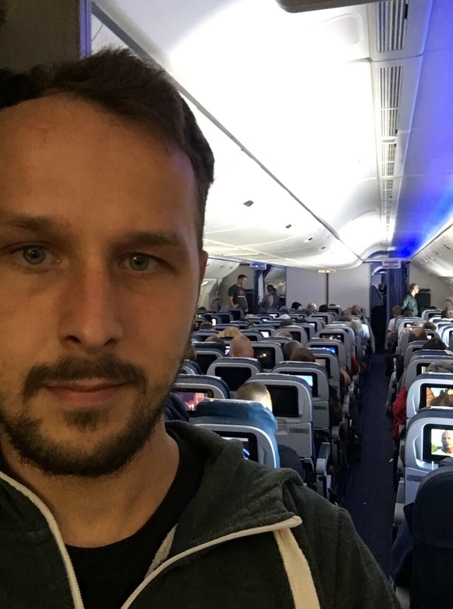
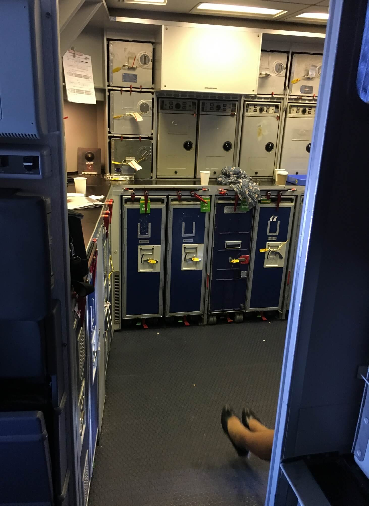
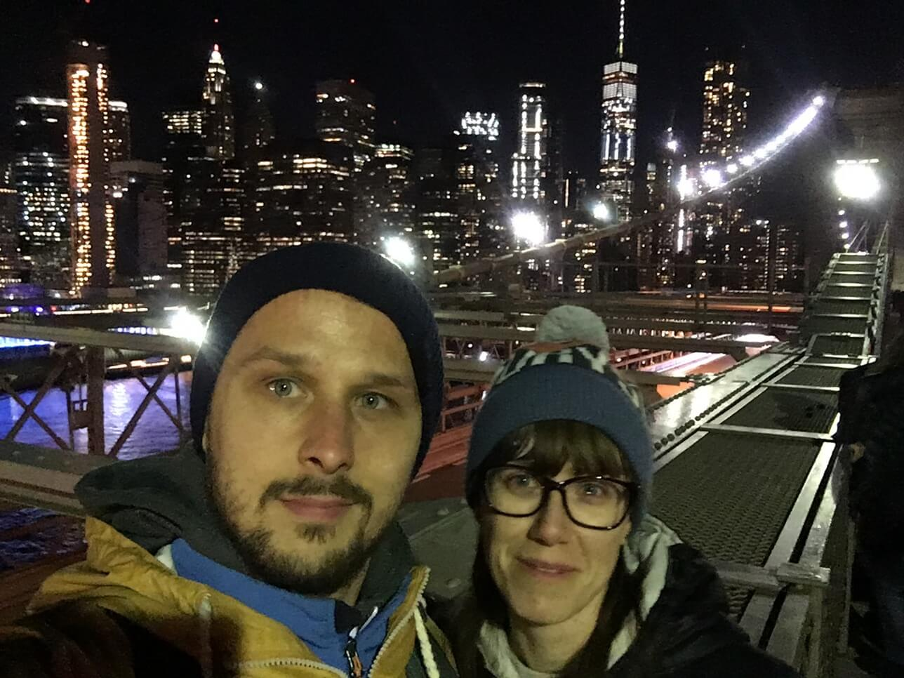

## Prolog

Jest 22:06 czasu nowojorskiego, 4:06 czasu polskiego. Tutaj zaczynamy. Naszą podróż i relację z niej. Dzisiaj dokonaliśmy kilku pierwszych razów. Pierwszy raz cofaliśmy się w czasie, pierwszy raz byliśmy na Ukrainie, pierwszy raz przelecieliśmy Atlantyk. No i pierwszy raz jesteśmy tutaj w Empire State of mind. 22:10 pierwszy raz piszę wpis na naszym blogu. Adam Romański miał bardzo fajny tytuł swojego bloga - "piszę, bo zapominam". No i ja też dlatego piszę. Bo zapominam. By nie zapomnieć.

## No dobra. O paru rzeczach bym chciał zapomnieć

O śmierdzigębie siedzącym obok mnie w samolocie.

O braku szacunku na amerykańskim lotnisku, gdzie musieliśmy stać 2 godziny w kolejce ciągnącej się przez kilka zakrętów. Dodatkowo wysłuchując teksty "Are you from Ukraine? Are you from Ukraine? Yes, I see that from your faces".

 

O tym jak jestem padnięty.

## O czym nie chcę zapomnieć?

O pierwszym locie transatlantyckim.

 

 

O pierwszej jeździe nowojorskim metrem.

O widoku Manhattanu nocą.

O przejściu wieczorem Mostem Brooklińskim.

O tym, że warto upewnić się czy się idzie we właściwą stronę. Właściwa strona to zwykle przeciwna do tego, w którą stronę idę.

O tym, że nawet mając jeden plecak na plecach, a drugi na brzuchu jest nieźle. Nawet bardzo.

## I o tym, że to dopiero początek, że ciąg dalszy dopiero nastąpi.

