Nie jestem osobą najlepszą w pamiętaniu numerów. Daty, terminy, liczby nie jest to coś nad czym jestem w stanie zapanować. Jednakże, Ulicę Sezamkową zawsze sponsorowały numery. Oto i one:

## 1
Jak pierwszy doughnut, pierwszy burger zjedzony w stanach. Pączek miał wszystko co trzeba, dziurkę w środku, polewę na wierzchu oraz posypkę, był nieco pulchniejszy od naszych, no i wiadomo słodziutenki. Ogólnie pączek jak pączek - wrocławska trumienka i tak rządzi! Burger przypominał na pierwszy rzut oka McDonaldsowego, ale w smaku był świetny, bardzo dobra karmelizowana cebulka i mięso. Mniam.

## 4 

Tyle na moje oko godzin trwała parada na 5th Avenue. Kojarzycie koncówki amerykanskich filmów, nie? Tam gdzie (super)bohater ratuje świat, lub chociaż amerykę (co w sumie wychodzi na to samo). No i tam zawsze są parady, samochody z platformami, śpiewy tance, werble. Tak to właśnie wyglądało. O ile się nie mylę w 150 rocznicę centrum hiszpanskiego. Tance flamenko, indianskie z ameryki południowej, portorykanski rock, argentynski pop i nie wiem co jeszcze. Hałas, radość, pozytywne emocje, ciężko się nie uśmiechnąć i nie zacząć się bujać w rytm muzyki. No dobra, można, koło mnie szybkim krokiem uciekał chłop z zatkanymi uszami, malkontenci są wszędzie. Nie tylko w Polsce.

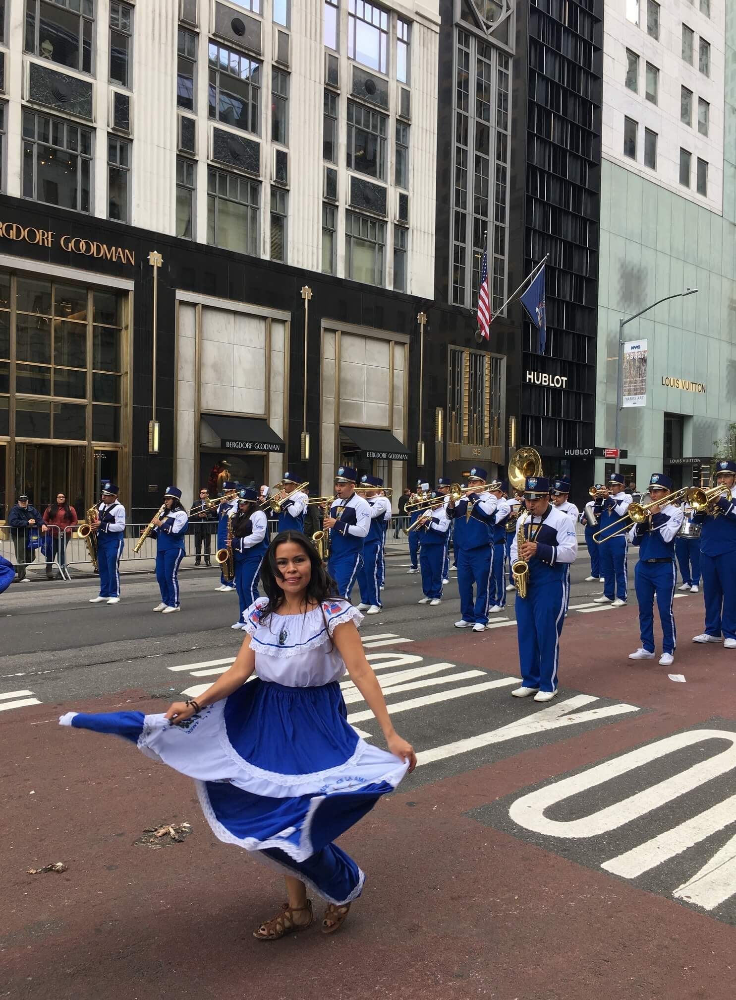
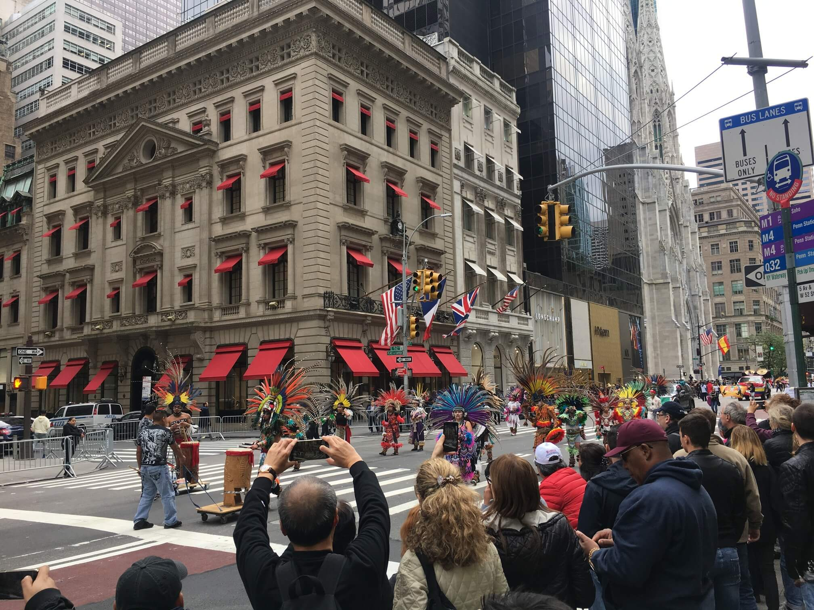
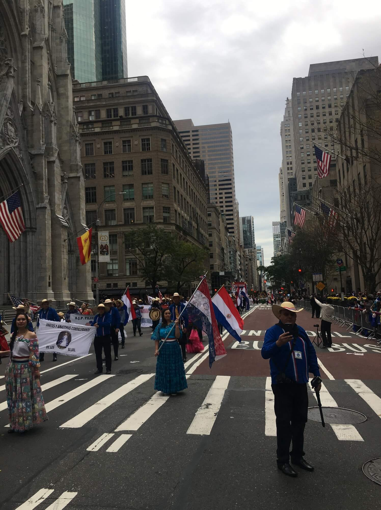

## 5
Jak 5th Avenue. Czyli główna aleja Manhattanu. Tutaj możemy zobaczyć największe wieżowce w pełnej okazałości. Tutaj możemy zjeść śniadanie u Tiffany'ego. Pomodlić się w kościele św. Tomasza (ewangelicki) lub katedrze św. Patryka (katolicki). Widok tych budynków naprawdę zapiera dech w piersiach. Ciężko nawet to opisać. Zresztą, co będę sobie strzępił język zobaczcie sami:

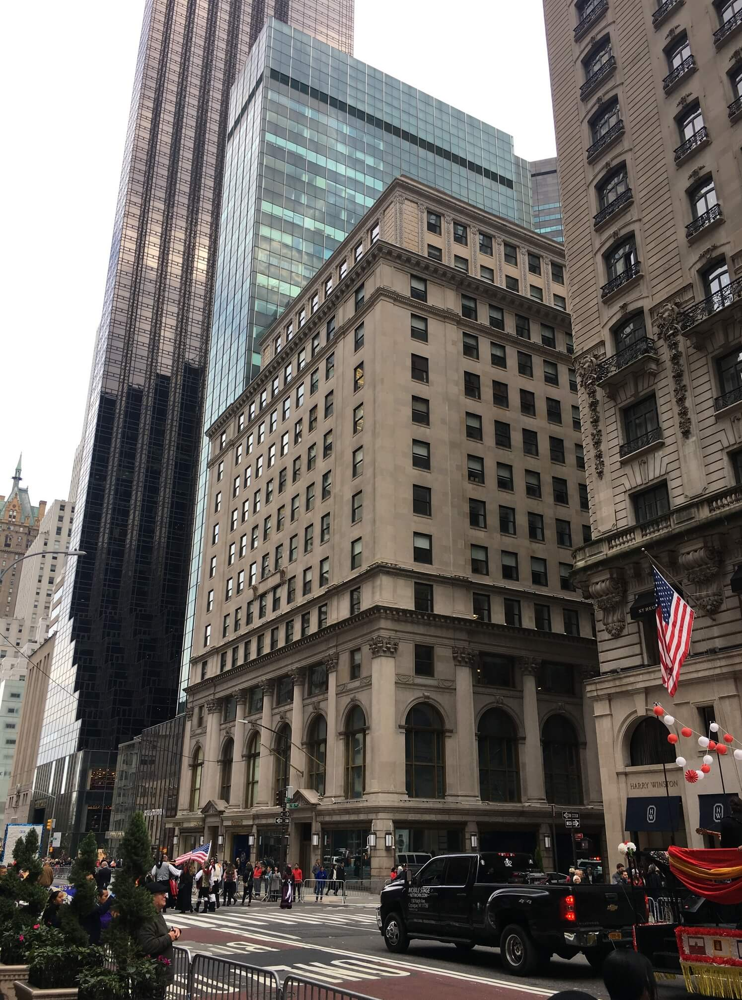

## 8
Czyli cztery łapy i cztery kółka. Łapy, łapy cztery łapy, a na deskorolce pies kudłaty. Przesadziłem trochę, kudłaty nie był. Za to był grubiutki i śmigał na deskorolce lepiej niż ja w najlepszych latach (tak nie byłem wybitnym deskorlkowcem). Takie rzeczy można zobaczyć w Central Park. 

Central Park i ogólnie Nowy Jork jest świetny. Niesamowicie jest się móc przemieszczać po miejscach, które znało się do tej pory tylko z filmów. Hotel Plaza i park z Kevina z Nowego Jorku. Jezioro i ławeczki. Jest tylko jeden problem, ciężko się przemieszczać z miejsca na miejsce, bo tylko by człowiek cykał zdjęcia.

Mnóstwo ludzi, zielen, spacerowicze, równie duże i ładne parki widziałem chyba tylko w Londynie. Jedyne co mnie zastanawia to czy naprawdę wiosłowanie po jeziorze jak w filmach, razem z kilkudziesięcioma innymi parami robiącymi to samo jest faktycznie takie romantyczne? Ja tam się nie znam.

## 12
Tyle właśnie godzin wskazuje zegar w Grand Central Terminal. Oryginał z niego, nie? Na jego usprawiedliwienie dodam, że pokazuje je na dwa sposoby: AM i PM. Niestety patrząc na niego nie ocenisz, który akurat pokazuje. Ale zaufaj mi, on zna się na rzeczy.

Zna się na rzeczy, bo jest w koncu zegarem dworcowym. Zegary dworcowe muszą się znać na tych sprawach. Pilnują, żebyś się nie spóźnił. A spóźnić się możesz, bo jak staniesz na środku tego pięknego dworca, zaczniesz się rozglądać i to idzie stracić sporo czasu. Możliwe, że tyle, że już sam nie będziesz wiedział czy jest AM czy PM. A zegar Ci tego nie powie.

## 18,4
Liczba kilometrów, które wczoraj zrobiliśmy. W sumie jako, że jestem w stanach, to powinienem powiedzieć, że 11,4 mili. Niezależnie czy w kilometrach czy milach jest to trasa wystarczająca by położyć mnie do łóżka zaraz po powrocie i pozwolić wstać dopiero rano. Tak to jest ten stan ze śliną na poduszce.

## 19

O tej porze roku w Nowym Jorku słonce zachodzi około godziny 18:16. Dla pewności odczekaj sobie trochę. 45m będzie w sam raz. Udaj się na Times Square. Jedno z dziwniejszych miejsc jakie widziałem do tej pory. Tłuuuuumy ludzi. Kolorowo, jasno jak w dzien. Telebimy, telebimy wszedzie. A w nich M&Ms kręcący tyłkiem, modelki, reklamy. W-A-R-I-A-C-T-W-O.

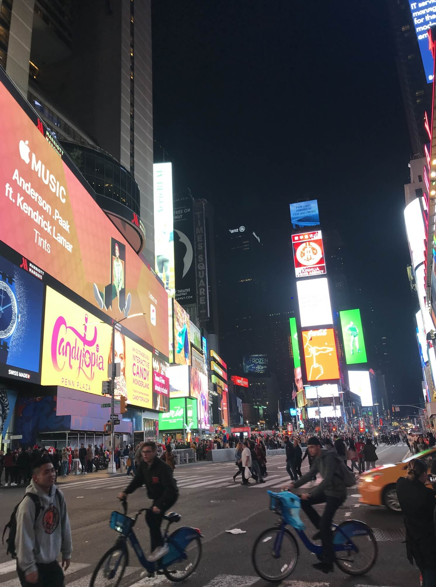
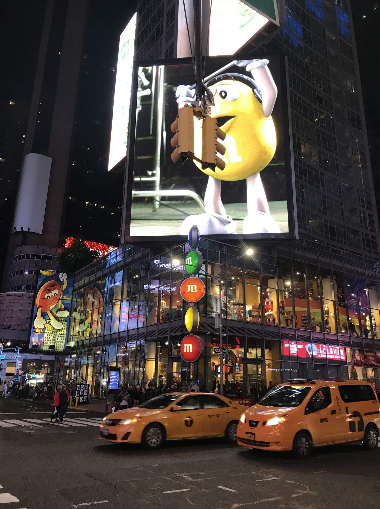

## 67
Jest to numer piętra, na którym znajduje się punkt widokowy Top of The Rock. Czyli sam szczyt Rockefeller Center. Sam szczyt stolicy świata. W zasadzie to powinienem napisać 67-69. Wysiada się na 67, następnie wchodzi się piętro wyżej a potem piętro wyżej. Doskonale widać panoramę całego Manhattanu. Mógłbym jeszcze dodać 360. Wjechaliśmy tam tuż przed zachodem słoca i był to najlepszy możliwy wybór. Widzieliśmy jak miasto gaśnie by ponownie się zapalić. Piękny widok na Empire State Building. Cena niezła bo 36 dolców, od osoby, ale można siedzieć ile się chce. Szczególnie polecam parapety okienne, można sobie siedzieć, delektować się, nikt z obsługi nie wygania. Co najwyżej japonscy turyści uważający, że okno jest wspólne. Może i jest, ale wtedy było nasze prywatne. Polecam też posłuchać co wyczyniają ludzie z obsługi kierujący ruchem ludzkim. Śpiewają, rymują, rapują udają Pac Mana, wszystko z dużym uśmiechem. Cóż, jakoś trzeba sobie radzić w pracy.

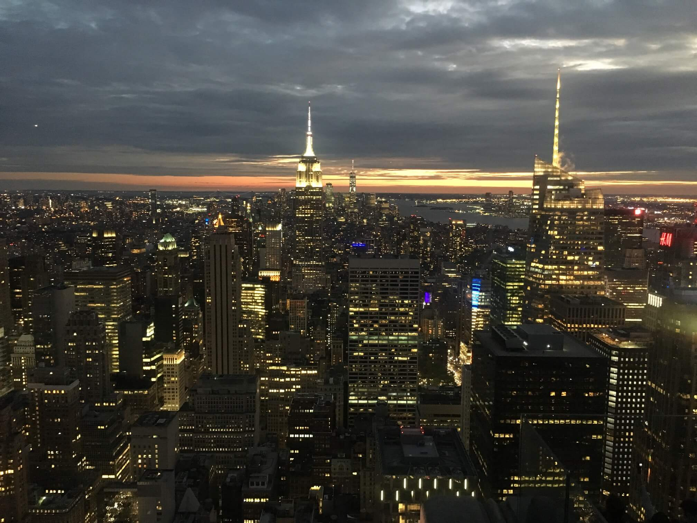
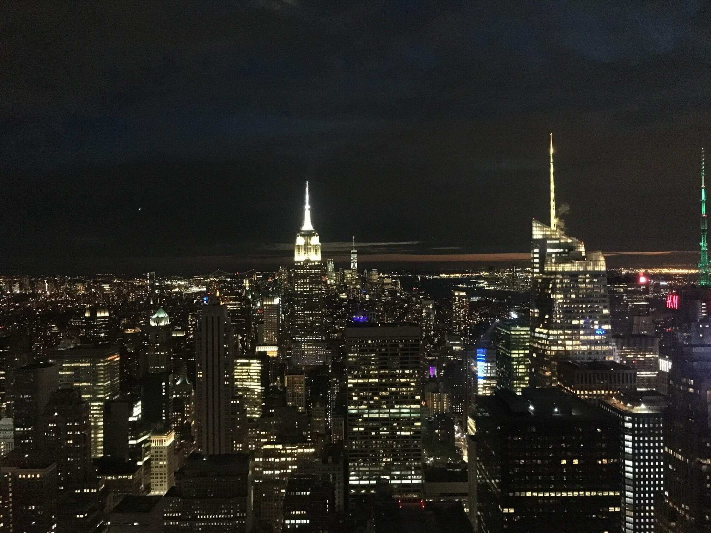
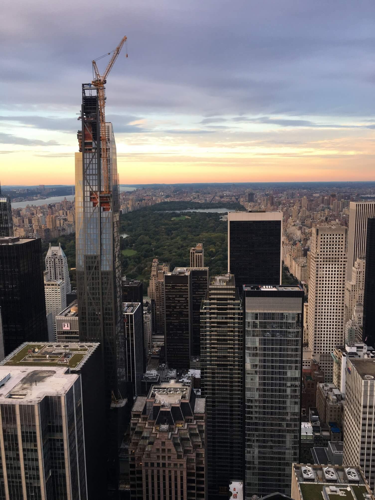

No i lodwoisko! Lodowisko! Tak, mieliśmy szczęście, otworzyli je już w październiku. Te radosne krzyki to wzniosła Diana. Ja nie krzyczę, bo nie jeżdę, ani nie jeździłem. Pingwinków nie widziałem, więc tym bardziej. Diana krzyczała, ale jednak trochę się bała i nie pojeździła. Może jutro, lub pojutrze, tudzież następnym razem.

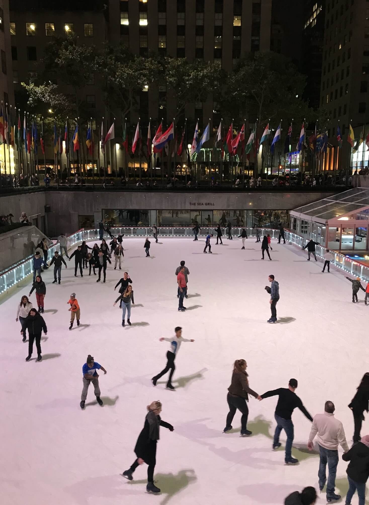
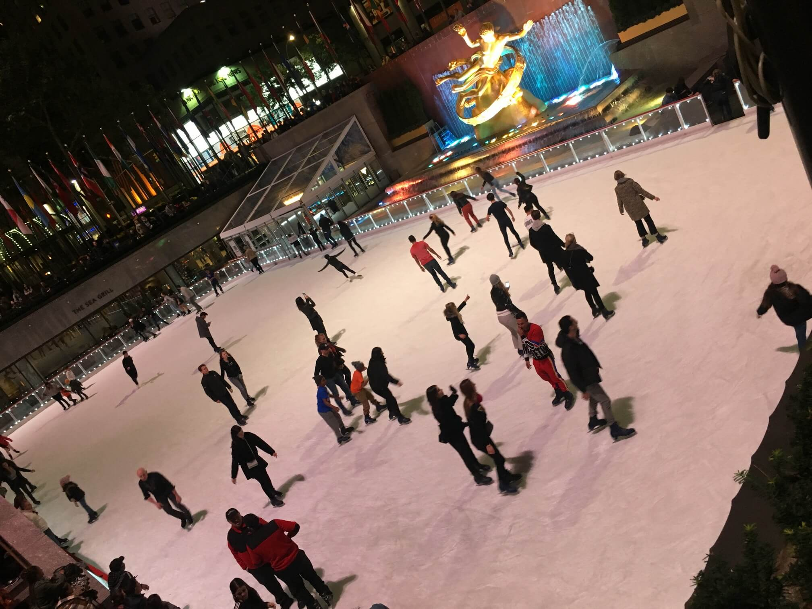