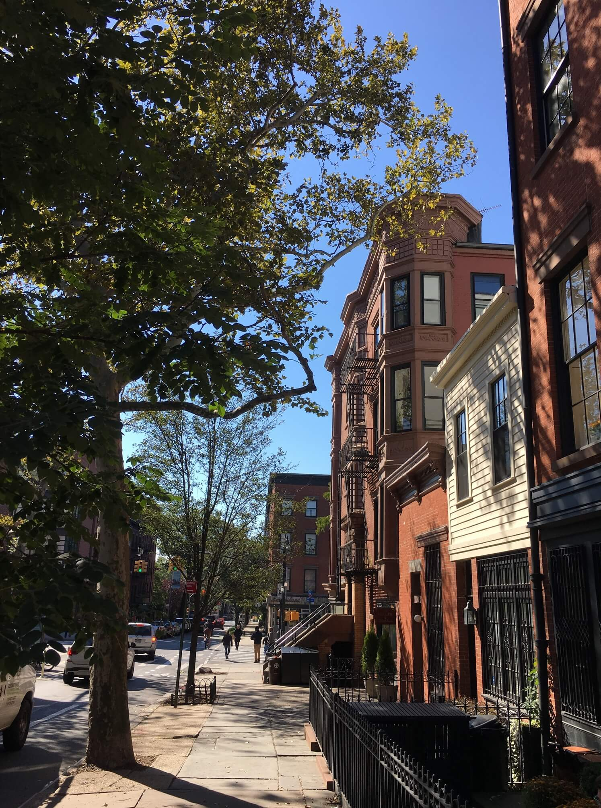
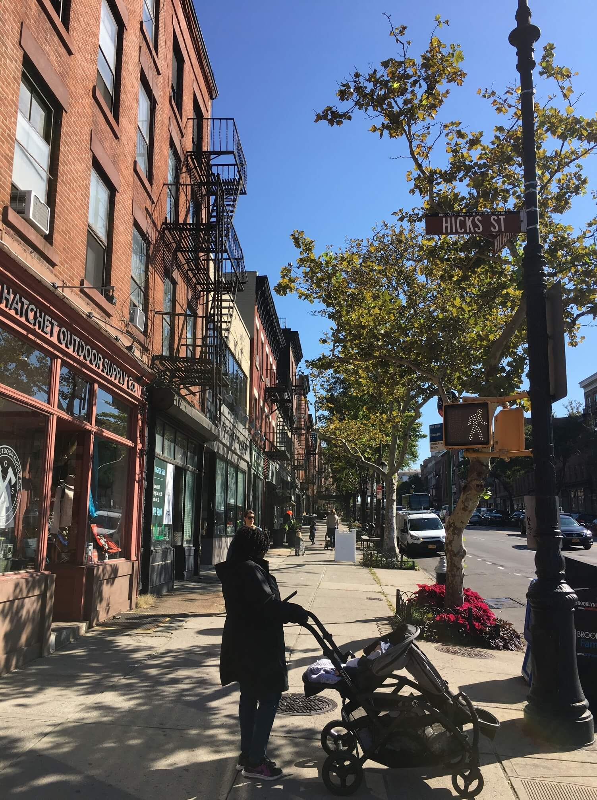
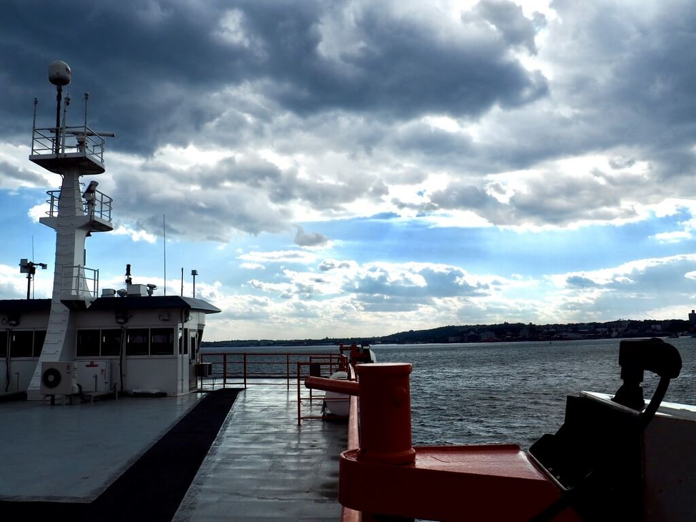
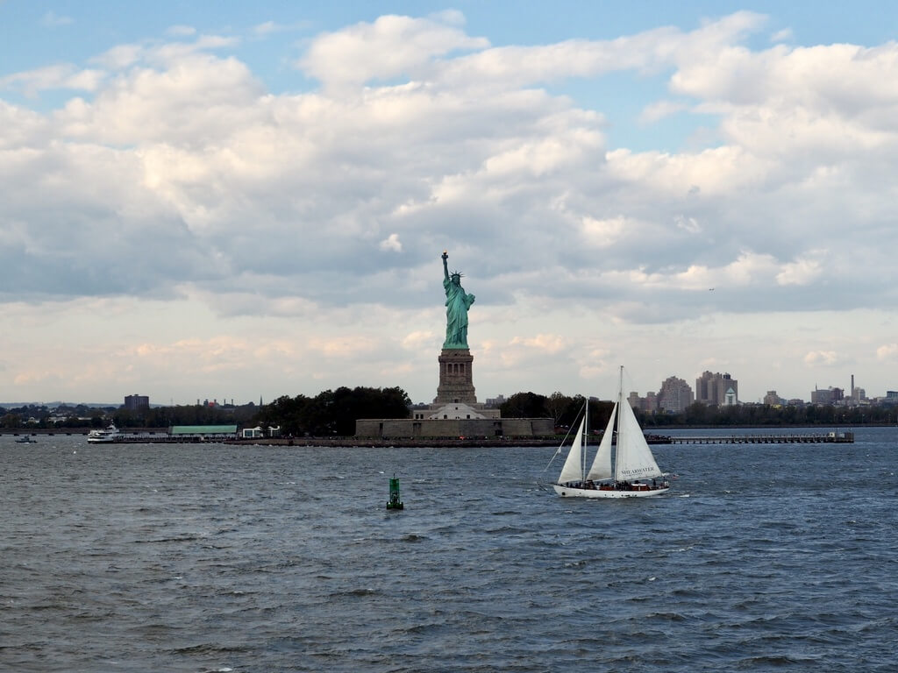
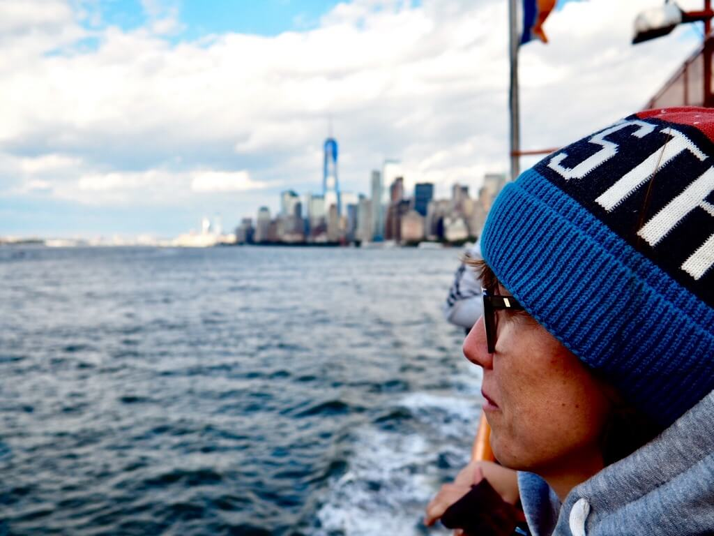

Człowiek najmniej docenia to co ma najbliżej. Tak też i my mieszkając na Brooklynie zwiedziliśmy go dopiero na sam koniec. No dobra, pierwszej nocy przypadkowo nieco go złapaliśmy. Potem zwiedzając Dumbo oraz Brooklyn Heights zobaczyliśmy jego nadbrzeża. Ale czy to pokazało nam jego faktyczny urok? Wytłumaczyło czemu Jay Z i Beyonce tak go pokochali? Ciągle to odwlekaliśmy. Jutro, jutro.

No i w koncu rzutem na taśmę nam się udało. Ruszyliśmy z naszej Gold Street w Jay Street, następnie Smith Street a potem odbijając w prawo i już idąc na czuja tam gdzie uznaliśmy za ciekawe. Trochę pokręciliśmy się w kółko. Trochę skręciliśmy w lewo, trochę w prawo. Staraliśmy się złapać klimat tej dzielnicy. Brooklyn zwany jest sypialnią Manhattanu. Trochę słusznie, trochę niesprawiedliwie. 

Jest tutaj spokojniejszy klimat, niskie 3 piętrowe ceglane domy. Wnuk zajeżdżający do Babci po jakieś rzeczy. Małe sklepy, pralnie. Dlatego słusznie. Dlaczego niesprawiedliwie? Bo jest tutaj coś więcej, jest ten specyficzny urok, specyficzny klimat starszej dzielnicy. Nie do podrobienia.

Szukaliśmy, szukaliśmy i znaleźliśmy. Chcieliśmy zjeść dobrego bajgla i nam się udało. Court Street Bagels. Typowy amerykanski lokal z bajglami, lokalsami i kawą z eksperesu przelewowego. Ok, prawie. Ekipa była latynoska, z której tylko jeden mówił po angielsku. Poza tym wszystko już jak należy. Porcja oczywiście ledwo do przejedzenia. Sami popatrzcie. Diana nie dała radę całego zjeść

Tutaj dwie dygresje. Pierwsza: Gdy w stanach ekspedient zapyta się Was czy chcecie kawę z cukrem mówcie: NIE! No chyba, że lubicie likier kawowy, lub macie niedobór cukru. Kawa z cukrem jest tak słodka, że trzeba ją zagryzać, zeby wypić. Druga dygresja: w Stanach większość znaków i informacji jest dwujęzyczna. Po angielsku i po hiszpansku. Spora część bowiem latynosów radzi sobie całe życie bez nauczenia się angielskiego w stopniu chociaż komunikatywnym.

Objedzeni i przesłodzeni ruszyliśmy do **Prospect Park**, czyli tzw. brooklinskiego Central Parku. Z podobienstw to jest też duży (ale mniejszy), też ma jeziorko. Poza tym jest jednak inny. Mniej komercyjny, bardziej dziki, dużo, dużo spokojniejszy. Tak jak ogólnie Brooklyn. Przez środek parku biegnie droga asfaltowa. Idealne miejsce by zjechać na rowerze lub pobiegać. 

Wyczilałtowani ruszyliśmy metrem znowu do [jądra ciemności](/jadro-ciemnosci). Tuż przy Wall Street kursują promy na **Staten Island**. Jest to wyspa, którą podobno każdy nowojorczyk chętnie by oddał, a jeszcze dopłacił byleby ona nie była częscią ukochanego miasta. Wielkomiejscy manhattanczycy uznaja ją za "wieśniacką". Być może podobnie jak najfajniejszą rzeczą w Sosnowcu jest autobus to Katowic, tak i najfajniejszą rzeczą na Staten Island jest **prom na Manhattan**. Prom rusza z imponującego terminala. Jest za darmo. Kursuje co 20-30m. I co najważniejsze przepływa koło **Statui Wolności**. Zrażeni kolejkami oraz zachęceni poleceniami stwierdziliśmy, że podróż promem w pełni nam wystarczy. I nie żałujemy. Statua była fajnie widoczna, chociaż faktycznie widoczna jest z pewnej odległości. To co jednak nas najbardziej urzekło to widok na Manhattan. Panorama jest niesamowita. Każdy kto jest w New York i z tego nie skorzysta to pała.

Tutaj kilka porad dla januszy takich jak my. Ustawcie się wcześniej przed drzwiami. Celujcie w górny pokład otwarty. Płynąc w stronę Staten Island zajmujcie miejsca z prawej strony. Jeśli wejdziecie na pokład otwarty to załóżcie czapkę, kaptur, sztormiak, bo ostro wieje. Jodoterapia. Po wyjściu ze statku jeśli nie chcecie się nudzić na Staten Island to kierujcie się na prawo. My czekaliśmy 15 i od razu wracaliśmy.

Z promu wysłaliśmy obiecane kartki pocztowe. Ludzie ciągle to kochają! I ruszyliśmy na północny Brooklyn, gdzie spotkaliśmy się z koleżanką tylko po to, żeby zaraz ruszyć przez Manhattan do New Jersey. Tak jak Nowy Jork jest miejscem, w którym mógłbym mieszkać. Tak nowojorskie korki są tym co zdecydowanie mnie odstrasza. Tyle życia zmarnować w samochodzie. No way!

Dzien zakonczyliśmy kolacją w **Charrito's Weehawken**. Świetne meksykanskie jedzenie i **G E N I A L N Y  W I D O K**. Dla niego samego warto tam zjeść. Dodając do tego ręcznie robione przy stolicu Guacamole oraz przepyszny flan - naprawdę nie można dużo chcieć więcej.

Tak to właśnie zakonczył się nasz pobyt w Nowym Jorku. Pojawiła się lekka niepewność czy dalej będzie równie fajnie. Lekki smuteczek z opuszczenia Nowego Jorku. Coś się konczy, coś się zaczyna. Cel następny Boston i Manchester. Ale o tym w kolejnym wpisie.