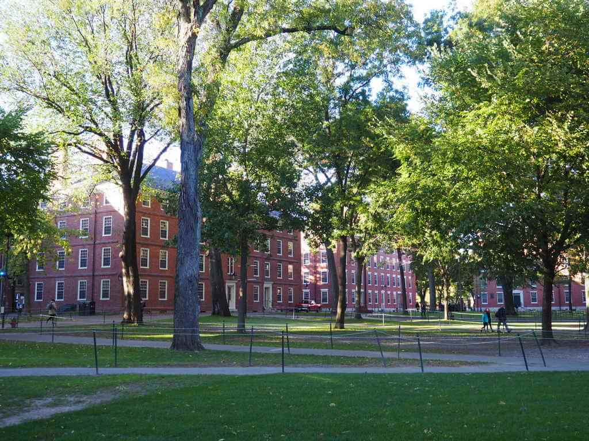
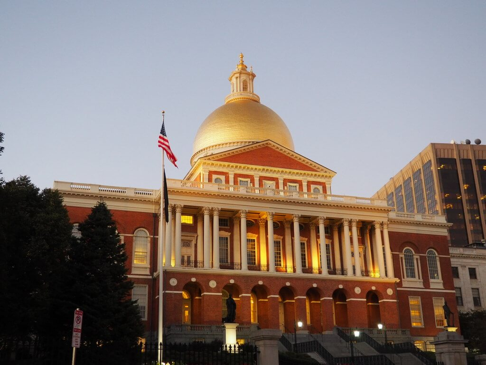
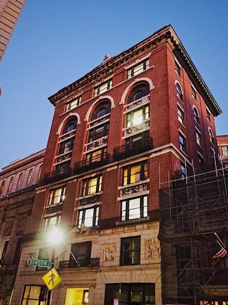

Dzisiejsze notatki piszę w niecodziennym miejscu. W takim miejscu, że w zasadzie powinienem napisać to trzynastozgłoskowcem. Nie lubiłem nigdy "Pana Tadeusza", więc sobie daruję. Co to za miejsce? **Bostonska biblioteka publiczna**. Diana czyta opowiadanie "Cisza i spokój". Wszystko się pięknie zgrywa, bo to nasze ostatnie godziny w Bostonie.

Ruszyliśmy tutaj przedwczoraj. Poszliśmy po cenie i pojechaliśmy Greyhoundem. Tak, tym legendarnym. Niestety legenda nieco przebrzmiała, bo autobus ani wygodny, ani czysty, ale tani. Cena czyni cuda. Ruszyliśmy ze znanego już nam wczesniej **Port Authority Bus Station**. Znanego z widzenia. Z Highline. Wytłuczeni wysiedliśmy na bostonskiej **South Station**. I tutaj zdziwienie - ziiiiiiiiiiimno. Tak, chłodne przywitanie nam Boston urządził. Od razu zaznaczył, że to już nie Nowy Jork. Koniec szalenstw, pośpiechu i gwaru. Tutaj trzeba zachowywać się spokojnie. 

No ale, ruszyliśmy pieszo do naszego ho(s)telu, na zimno ruch najlepszy w koncu. Tutaj ciekawostka, pierwszy raz byliśmy w ho(s)telu, w którym nie ma recepcji, nie ma kart, niczego. Za to wysoka cena. A i tak najtansze z miejsc, które nie były reklamowane smrodem stęchlizny. Podobno po wycieczce do stanów wraca się grubszym. My na pewno wrócimy lżejsi- o zawartość naszych kieszeni.

Nie narzekajmy, nie narzekajmy, bo nas noc zastanie. Nas zastała, ale o tym potem. Zmarznięci, wypakowani kupiliśmy nasza pierwszą kawę ze Starbucksa w Stanach. Kawa jak kawa, ja osobiście nigdy fanem tej sieci nie byłem. Pobyt w Stanach tylko tę opinię potwierdził. Starbucks i Dunkin Donuts jest tutaj na każdym rogu. Ogólnie ceny kawy w przeliczeniu są takie same jak w Polsce, więc tak - to jest tutaj tania sieciówka. Miejsce gdzie można zobaczyć żuli chodzących do kibla i dziwaków skubiących sobie brwi przy hockerze (męskich dziwaków). Kawa była dobra i tyle w tym temacie.

Tuż przy naszym ho(s)telu znajduje się metro. Bezpośrednio z niego, czerwoną linią ruszyliśmy na **Harvard**. Miejsce prosto jak z filmów. Ceglane budynki, trawniki, spokój, studenci krążący dookoła. Będąc w Bostonie koniecznie trzeba to zobaczyć. Teren jest olbrzymi, nacykaliśmy zdjęć jak głupi, ale żeby Ciebie drogi czytelniku nie zanudzić wrzucamy tylko kilka poniżej. Magiczne miejsce.

Z Harvard ruszyliśmy metrem do centrum. Wcześniej zaopatrzyliśmy nasze telefony o mapki **Freedom Trail**. Boston jest jednym z najważniejszych historycznie miast Stanów Zjednoczonych. Tutaj rozpoczynały się pierwsze wrzenia niepodległościowe. Na każdym kroku można znaleźć ważne miejsca. Wyznaczona jest tutaj trasa turystyczna zwana właśnie **Szlakiem wolności**. Polecam przejść przez nią, bo zahacza ona o większość miejsc, które jako turysta powinieneś obejrzeć w Bostonie. Swoją drogą jest to też ciekawe z jednej strony jak drobne wydarzenia mogą rzucić iskrę, która podpali cały kraj, lub z drugiej strony jak amerykanie są świetni w marketingu - nawet swojej historii. "Bostonska masakra" - zginęło 5 osób. "Bostonska herbatka" - ile krajów rozpoczyna swój zryw o niepodległość od wsypania herbaty do wody? Morskiej, nie wrzącej. 

Tak czy inaczej warto te wszystkie miejsca zobaczyć, bo Boston jest zupełnie innym miejscem niż Nowy Jork. Ma oczywiście swoją część finansową. Jest to bowiem miasto biznesu oraz centrum IT. Znajduje się tutaj również słynny **MIT** - Massachusetts Institute of Technology - jedna z najlepszych politechnik na świecie. W centrum jednak jest dużo niskiej zabudowy. Starszych budynków, oraz faktycznie miejsc mocno historycznie znaczących. Podążająć **Freedom Trail** warto odbić koło **State House** w **Beacon Street** tam pod numerem **14**. Znajduje się budynek znany z serialu **Ally McBeal**. Gimby mogą nie znać.

Wspominałem, że noc nas zastała? Ano zastała. Znajdowaliśmy się wtedy na **Hanover Street** - miejsce, które ożywa po zmroku. Jest tutaj pełno knajpek, głównie włoskich. Bostonczycy przychodzą tuaj po pracy spotkać się ze znajomymi, wypić coś, pogadać. Nie jest to ulica imprezowa, ale świetnie oddaje klimat Bostonu. Jest swojsko. Obok **Hanover Street** znajduje się też sporo irlandzkich pubów. W jednym z nich **The Bell In Hand Tavern** - reklamującym się jako najstarsza bostonska tawerna zjedliśmy słynne **lobster rolls**. Jest to po prostu bułka z homarami, z masełkiem, przyprawami, na ciepło. Plus pyszne amerykanskie piwo. Mniam.

Najedzeni, zrezygnowaliśmy z dokonczenia **Freedom Trial**. Zostawiliśmy to sobie na następny dzien. Dalej było jak w kieleckim. Spacer kosztował nas lekkie przeziębienie, nawet teraz krępuje mnie pociąganie nosem w tej cichej i spokojnej bibliotece. Kto mówił, że będzie łatwo? 

Na pewno łatwo nie było wstać na następny dzien, a musieliśmy to zrobić nieco wcześniej niż zwykle, bo około 7. Naszym celem był pobliski stan **New Hampshire**. A konkretnie miasto **Manchester**. Tak jak Boston jest wielkościowo równy Wrocławiowi, tak Manchester jest podobny do Legnicy. Jadąc autokarem Boston Express mieliśmy okazję oglądać piękną jesien. Dalej nie było najcieplej, ale słonce pięknie świeciło, a kolory liści pięknie wyglądały za oknem. Po co tam jechaliśmy? Chciałem zobaczyć na żywo biuro i pracowników mojego klienta, których do tej pory widziałem tylko przez komunikator. Jest to mój aktualnie ulubiony klient. Zostaliśmy przyjęci bardzo miło, zjedliśmy świetny lunch w typowej amerykanskiej restauracji, pogadaliśmy, pozwiedzaliśmy. Doug, jeden z moich współpracowników przekupił Dianę polskimi Delicjami i Kinder Bueno dodając, że jest bardzo cierpliwa godząc się ze mną do nich przyjechać. Miasteczko faktycznie, nie jest super efektowne, ale sympatyczne. Spokojne miejsce, ładna wiktorianska zabudowa, dawne młyny przerobione na loftowe biura. 

Do Bostonu wróciliśmy koło 15. Pogoda była nieco bardziej sprzyjająca. Stwierdziliśmy, że dokonczymy to co zaczęliśmy wczoraj, czyli **Szlak Wolności**. Pozostała część okazała się nawet bardziej malownicza. Spacer nadbrzeżem, przejście przez stary, chybotliwy most (Diana z zamkniętymi oczami) i dotarcie do **Charlestown**. Piękna kolonialna dzielnica Bostonu. Kolorowe domki, pagórki, spokój cisza, a na samym szczycie obelisk wielkiej bitwy o niepodległość z Anglikami. Przegranej. Wspominałem już o marketingu, nie?

Z górki zeszliśmy do portu gdzie cumuje **USS Constitution**. Cytując Wikipedię. "Amerykańska trójmasztowa fregata o kadłubie wykonanym z drewna dębowego. Jest najstarszym pływającym i pozostającym w czynnej służbie okrętem świata". Wybudowana w 1795 roku, oczywiście w Bostonie. Ma nawet armaty. 

Potem by wyrobić dzienny limit kilometrów wróciliśmy na piechotę do naszego ho(s)telu. Wracaliśmy też przez Hanover Street. Zahaczając o cukiernię **Mike's pastry** i kupując ichniejsze **cannoli**. Były one świetną nagrodą za dobrze spędzony dzien. Na koniec obejrzałem na komputerze mecz NBA Toronto Raptors i Boston Celtics. Dodając do tego, że jeszcze zapytany o drogę pomogłem jakiemuś chłopakowi trafić do metra - poczułem się jak prawdziwy bostonczyk.

Niestety bycie bostonczykiem właśnie się konczy, tak jak i ten wpis. Z miejsca, w którym siedzę udamy się do ho(s)telu. Zgarniemy nasze plecaki i ruszamy na lotnisko. Cel - Nevada. Viva Las Vegas!

Pisał dla Was. Oskar Mietek Dudycz. Boston, stan Massachusetts.