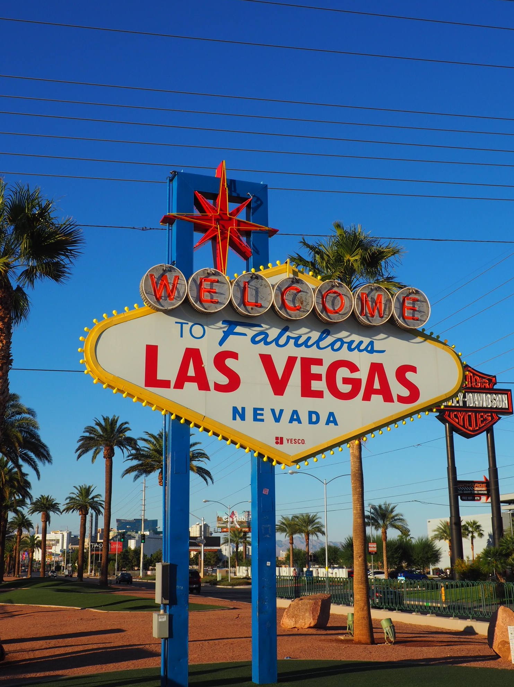

Czy ten wpis mógłby mieć inny tytuł lub zdjęcie? Retoryczne pytanie. 

Dopiero co zostawiliśmy zimnawy i stateczny Boston, spokojne New Hampshire. Ze zgiełkiem schodziliśmy krok po kroku w dół. Harmider Nowego Jorku, stateczność Bostonu, spokój i przyroda New Hamsphire. I bum. Pięścią w nos. Ze skrajności w skrajność. Yin i Yang. Viva Las Vegas!

Po 6 godzinnym locie, mocno styrani, wyladowaliśmy o 23:30 na lotnisku McCarran w Las Vegas. Czy też 11:30 PM PST. Lub 2:30AM EST. Lub 8:30 czasu polskiego. Te 2 ostatnie już kolejnego dnia. Idzie się zakręcić. Mój zegarek wskazuje czas polski, telefon aktualnej strefy w USA. Szalenstwo. Po przylocie zastanawiałem się, czy zadzwonić już do brata z życzeniami urodzinowymi. Wariactwo.

Wariactwo, jeszcze większe zobaczyliśmy tuż po wyjściu z samolotu. Od razu automaty. Szybciej można stracić pieniądze niż odzyskać bagaż. Poza tym wszystko sprawnie, długi spacer przez duże lotnisko. Podróż Uberem. Meldunek w hotelu. Check in po północy? No problem - this is Vegas. Noc jeszcze młoda. Apartament 60 metrów. Nice. I tu ciekawostka - noclegi w Vegas są dużo tansze niż w innych miejscach w Stanach. Za 4 noce w wysokim standardzie zapłacimy mniej niż 2 noce w Bostonie. Wliczając pieniądze stracone w kasynie. Ale o tym później. Póki co poszliśmy spać.

Odespaliśmy, grzebaliśmy się nieco - wymęczeni długim lotem. Poza tym po co się spieszyć? W Vegas dzien jest nocą, a noc dniem. Yin i Yang. Główną arterią miasta jest **Las Vegas Strip**. Jest to wielka, 5 pasmowa momentami, droga szybkiego ruchu. Czy zaskoczy Was jeśli powiem, że po jego obydwu stronach ulokowane są kasyna? Kolejne retoryczne pytanie. W zasadzie to nie są kasyna, to jest cały świat. Idąc Strip mijasz Paryż z Luwrem i wieżą Eiffla. Gdyby nie to, że [rejs na Staten Island](/cos-sie-konczy-cos-zaczyna) był darmowy to byśmy żałowali, że z niego skorzystaliśmy bo Statuę Wolności mieliśmy tutaj na wyciągnięcie ręki. Przeszliśmy drugi raz w tym wyjeździe przez Most Brooklinski. Byliśmy również w Egipcie - widzieliśmy zarówno Sphinxa jak i piramidę. Mogliśmy się również przenieść w czasy starożytnego Rzymu. Gdybyśmy jeszcze pochodzili trochę to odwiedzilibyśmy Wenecję, wieżę telewizyjną w Seattle. Świat na wyciągnięcie ręki.

Jest taka [scena w Edim](https://youtu.be/4qWt9HvtNvo?t=755) gdzie Jureczek mówi "Tu jest raj! Wszystko tu jest! Pralka, telewizor... to nie raj?", Edi odpowiada "A co to za raj, który dzisiaj jest, a jutro go nie ma". Tak też jest w Vegas. 

Cofnijmy się nieco w czasie. W czasach faraonów i Cezara już byliśmy, tym razem nieco bliżej - 1931 rok. Od dwóch lat trwa Wielki Kryzys. Rozpoczęta zostaje budowa tamy Hoovera. Zwanej wtedy jeszcze tamą Boulder (od nazwy pobliskiego miasteczka). Jedną tamę zaczęto budować, drugą zlikwidowano. W tym samym roku w Las Vegas zalegalizowano hazard. Ludzie muszą jakoś zabić czas, rozerwać się - grają. A jest ich coraz więcej: inżynierowie i budowniczy tamy, turyści, później też naukowcy i pracownicy pomocniczy uczestniczący w projekcie Manhattan (tak, tym od bomby atomowej).
Inne wydarzenie 1931 roku - Al Capone został skazany. Koniec kariery. Rok 1933 - koniec prohibicji. Wschodnie wybrzeże robi się coraz ciaśniejsze i coraz trudniejsze do działania dla mafii. Zachód stoi otworem. Kawał tortu do podziału.
Nie trzeba być historykiem, żeby to wiedzieć. Ojciec chrzestny, Blow, czy też mój ukochany serial dziecinstwa [Crime Story](https://www.youtube.com/watch?v=Is5ofSHZWTM). Yin.

Czy czuje się tę historię idąc ulicami Vegas? Być może stojąc przy znaku. Jest pn oldschoolowy. Stojąc przy nim ciągle czuć klimat drogich cadillaców, burbonu oraz słonca pustyni. Oczywiście jak człowiek przymknie jedno oko na turystów stojących w kolejce, a drugie na łysiejącego kolesia udającego Elvisa.

Poza tym czuje się adrenalinę. Słonce. Ja musiałem nawet kupić okulary, bo oczy łzawiły mi aż od słonca. Dziewczyny w pióropuszach i ich krągłe tyłeczki, z którymi możesz zrobić sobie zdjęcie. Tabuny ludzi. Głośniki z muzyką ustawione na chodnikach. Idziesz i chłoniesz tę hedonistyczną atmosferę. Te animacje, mrugające bilboardy. Kolory. Szczególnie gdy przychodzi zmrok. Guilty pleasure. Wiesz, że to tandeta. Mówisz sobie, że nie powinno Ci się to podobać. Ale jednak przypomina Ci się Kac Vegas. Myślisz, że jednak fajnie by było mieć tutaj wieczór kawalerski/panienski. Widzisz piękny pokaz fontan przed hotelem Bellagio. W ciemności nawet wyblakłe neony hotelu Flamingo zaczynają wyglądać dobrze. Wieża Eiffla zaczyna mieć swój urok. Endorfiny krążą. Podoba Ci się. Yang.

Wspomniałem wcześniej o porażce w kasynie? No tak. Historia, historią. Spacer po Strip, spacerem. Co to za wpis o Vegas bez kasyn? A kasyn, jest mnóstwo. Każdy hotel ma swoje. Praktycznie od razu po zameldowaniu możesz wejść i grać. No może poza hotelem Trumpa - nie dostał koncesji. Hotel w Vegas bez kasyna - great deal. Not. Wracając do kasyn - niezależnie czy jesteś turystą w klapkach i krótkich spodenkach, czy szykownym bogaczem możesz wejść do każdego, połazić, nie musisz nawet grać. Tak, możesz odwiedzić słynne Bellagio, Caesars, Venetian. Obejrzeć ich marmury. Zobaczyć miliony wpakowane w szklane sufity i złote klamki. Dotknąć tego przepychu.

Tak też i my zrobiliśmy, zanim zaczęliśmy grać zwiedziliśmy sobie kasyna. Diana nie jest hazardzistką, ja też nie specjalnie, ale jednak od czasu do czasu lubię sobie zagrać. Ustaliliśmy budżet 100 dolców. Wóz albo przewóz. Pierwszym moim typem była ruletka, gra w którą kasyno ma sporą przewagę, ale jednak można nie stracić, czasem wygrać, z przewagą na stracić. Tak czy inaczej przy dobrym założeniu i ograniczeniu budżetu można się dobrze pobawić, szczególnie, że jak się gra to można skorzystać z darmowych drinków. Wiadomo, wcięty klient to lepszy klient. Do ogrania przez kasyno. W Vegas minimalny zakład w ruletce (bet) to 4$ (zdarzają się i po 100$ i więcej). Czyli przy moim budżecie, tylko 25 zakładów do obstawienia. Zakładając, że obstawia się minimum 4-5 kombinacji w trakcie jednego zakręcenia ruletką, to daje 5-6 kolejek na wygranie czegoś. Średnio kuszące. Trzeba mieć farta. 

Zachodząc do kasyna **MGM** zauważyliśmy pokera, gdzie small blind miał 1$, a big blind to 2$. Dla niewtajemniczonych - są to stawki, które musi wyłożyć 2 graczy przy stole. Czyli tutaj zamiast 5-6 kolejek mógłbym zagrać co najmniej 10 razy więcej. Lubię grać w pokera towarzysko raz na jakiś czas. Nawet jakoś mi to wychodzi. Może nie wygram, ale może tez nie przegram, pogram trochę i z tego co mi zostanie spróbuję swojego szczęścia w ruletce. Tyle planu. Plan jest zawsze dobry. Szło mi dobrze, do momentu gdy szalony Chinczyk sprawdził mojego All Ina przed flopem (rozdaniem kart na stół) z parą ósemek. Ja miałem parę asów. Lepszej ręki w pokerze nie można mieć. A w zasadzie można. Może być nią np. para ósemek o ile np. dojdzie Ci jeszcze jedna na stole. Tak też stało się tym razem. Pech. Porażka. Frustracja. Koniec hazardowego budżetu. I wypiłem tylko jedno darmowe piwo, bo Pani kelnerka nie należała do najszybszych. Yin.

Może innym razem, może jutro - puściliśmy kupon na loterii. Do wygrania zaledwie 1.6 miliarda dolarów. Jak wygramy to spróbuję jeszcze raz przegrać 100$, a co! Stać mnie będzie! Kto bogatemu zabroni?

Tak i to zakonczył się nasz dzien w Vegas. Podobnie jak i tysięcy innych osób. Do Las Vegas przyjeżdża rocznie 40 milionów ludzi. Czyli więcej niż ludność polski. To tak jakby codziennie zjeżdżała się cała Legnica i Jawor i Złototoryja. Potem wyjechała i przyjechał Rzeszów. Potem Gliwice. I tak na zmianę.

Dla nas hazard się skonczył szybko. Zaczął się za to właściwy nasz cel przyjazdu do Vegas. Czyli potraktowanie go jako miejsca wypadowego do dwóch niesamowitych kanionów - Wielkiego Kanionu i Kanionu Antylopy. W momencie gdy to piszę wróciliśmy już z tego pierwszego. Jak było? Pięknie. Nisamowicie.

O tym już w kolejnym wpisie. Stay tuned!

Yang.