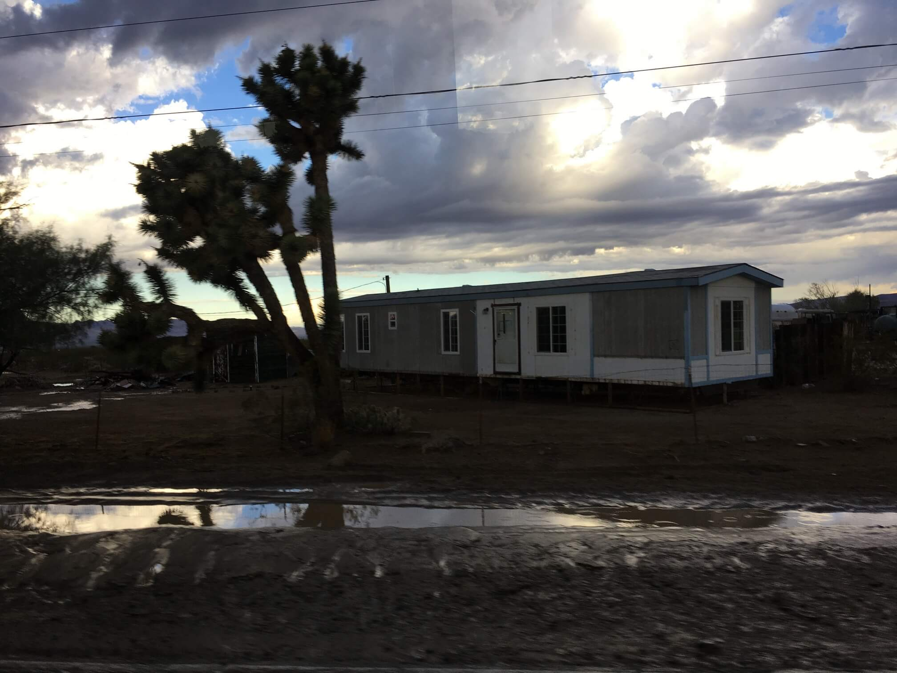
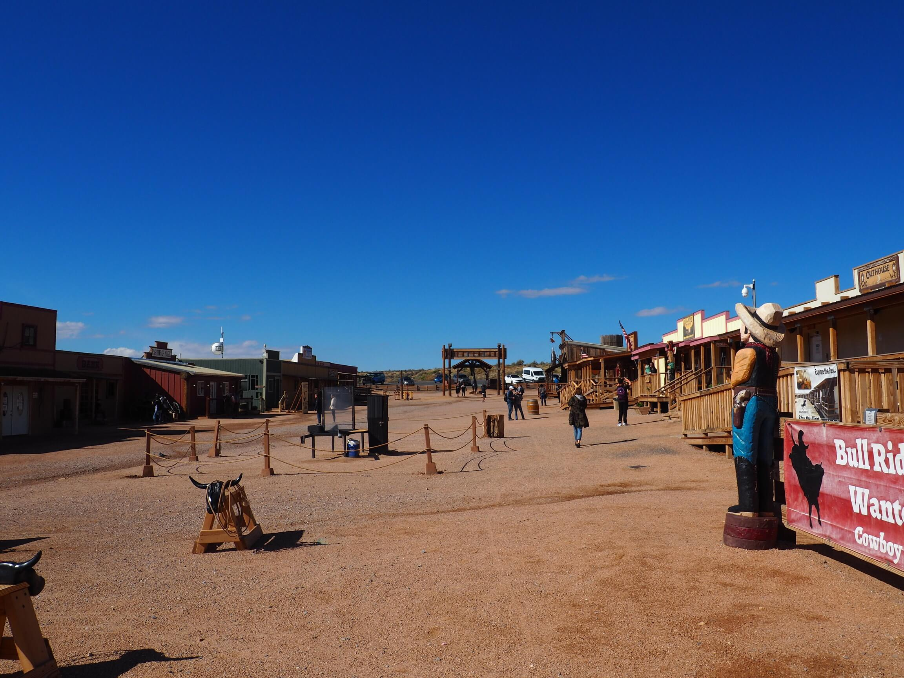
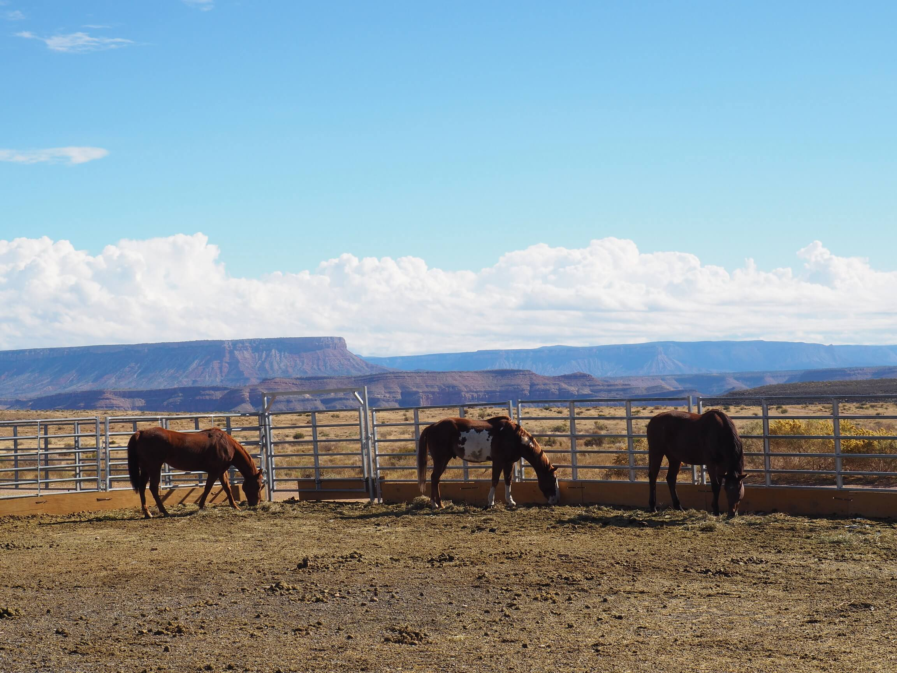
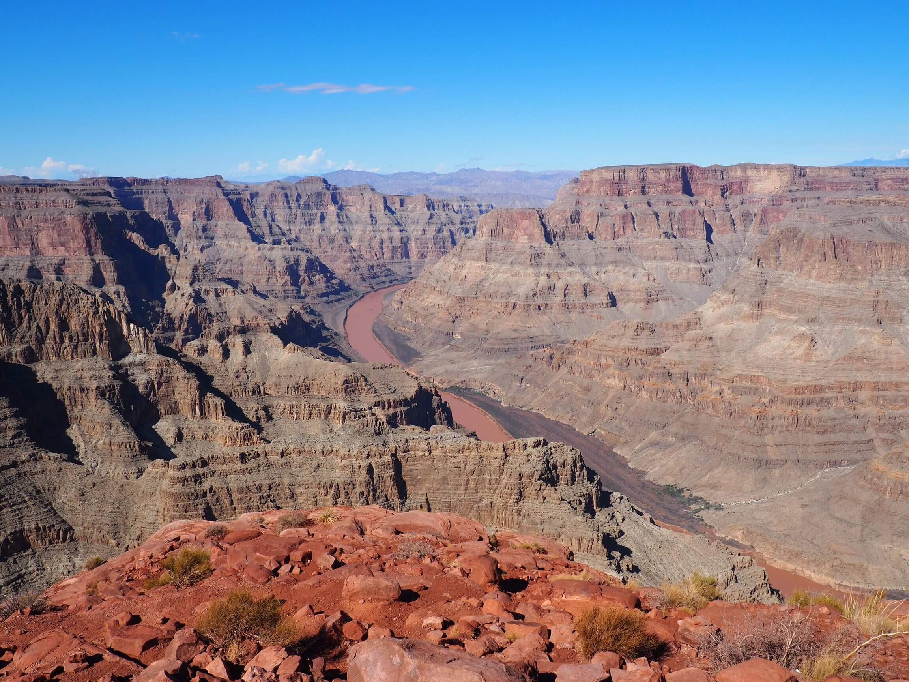
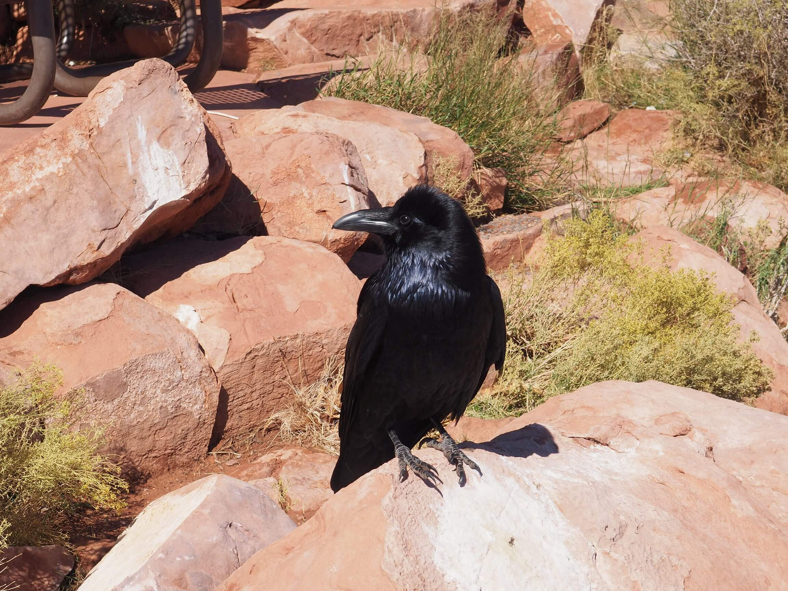
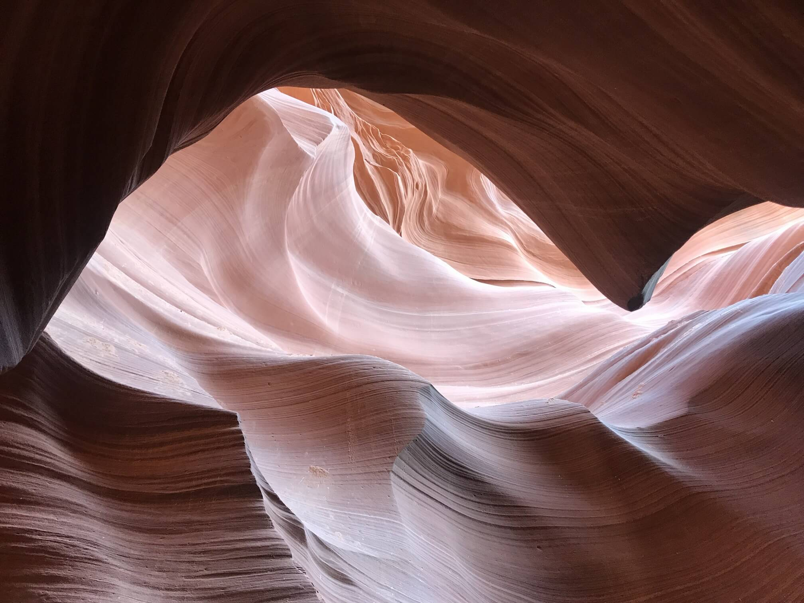

Jak zrobić kanion? Przepis jest zupełnie prosty. Bierzesz kawał ziemi. Najlepiej taką z wapieni i piaskowca. Puszczasz przez nią rzekę, najlepiej długą. Zaczynasz podnosić ten swój kawał ziemi do góry tak by powstał płaskowyż. Nie przejmuj się rzeką, ona sobie poradzi, będzie starała się utrzymać swój kierunek. Nieco pokluczy, nieco stworzy meandry, ale sobie poradzi. Proces powolnego podnoszenia kontynuuj. Jednocześnie rzeka zacznie się wżynać kropla po kropli w Twoją przygotowaną wcześniej ziemię. Odczekaj teraz nieco. Mniej więcej 270 milionów lat i Voila!

W życiu trzeba mieć szczęście. Często chcemy z wyprzedzeniem zaplanować każdy krok. Nie zawsze się sprawdza. We [wcześniejszym wpisie](/viva-las-vegas) wspomniałem, że od początku planowaliśmy uczynić Las Vegas centrum wypadowym. Wycieczek szukaliśmy przez Internet. Najlepsze oferty znaleźliśmy na [TakeTours.com](http://taketours.com/). Pisząc najlepsze mam oczywiście na myśli najtansze. Nie mam za to na myśli tanie. W Stanach nic nie jest tanie. Gdzie te szczęście? Chcieliśmy kupić na poniedziałek wycieczkę do Kanionu Antylopy, na wtorek do Wielkiego Kanionu. Już w zasadzie mieliśmy zarezerwowane. Wyszedł jakiś problem z kartą, coś tam się przeciągnęło i miejsca na poniedziałkową wycieczkę do Kanionu Antylopy się skonczyły. Zamieniliśmy, więc kolejność wycieczek. No to gdzie to szczęście? Już spieszę, już mówię. Gdyby pierwszy układ doszedł do skutku. To byśmy Kanionu Antylopy nie zobaczyli. Dlaczego? O tym za chwilę.

Las Vegas jest prawdziwym tyglem. Misz masz. Mnóstwo atrakcji, ludzi, kultur. Poza oczywistą amerykanska na przód wybija się chinska. Jest tutaj bardzo dużo turystów rodem z Chin. Ogrywają uczciwych ludzi w kasynach, pracują jako krupierzy i jak się okazało organizują również wycieczki. Najlepsze wycieczki. Bo najtansze. W sam raz dla nas.

Przepis na taką wycieczkę jest prosty jak przepis na zupkę Vifon (tak wiem, tani żart, ha ha). Kupujesz bilet, wybierasz punkt odbioru (czyli spod którego kasyna chcesz jechać), podjeżdża bus, wsiadasz, jedziesz. Najtrudniejszym fragmentem tego przepisu jest poranna pobudka. Wyjazd jest około godziny 6 rano.

Wspominałem, że uznaliśy Las Vegas za najlepsze miejsce wypadowe. Podobnie jak i najtansze nie znaczy tanie, tak i najlepsze nie znaczy wybitne. Odległości w Stanach są olbrzymie. To co w skali stanów znaczy najlepsze miejsce wypadowe? 2,5h jazdy samochodem w jedną stronę pierwszego dnia, 4,5h jazdy samochodem w drugą. A odległościowo? To tak jakbyśmy jednego dnia z Wrocławia pojechali do Torunia, podjedli sobie pierniczki, połazili, wrócili. A drugiego dnia dalej chętni do turystyki wybrali się do Rzeszowa zobaczyli podziemia Rynku, zobaczyli, że słynny pomnik Nike pasuje idealnie do Sky Tower i wrócili. Takie tam małe wycieczki.

Zatem poniedziałek, godzina 6 rano, parking przed Bally's. Zajeżdża po nas bus, na pierwszy rzut oka bez przewodnika - potem okazuje się, że sympatyczny pan kierowca z dalekiego wschodu będzie łączył te dwie funkcje. Zbieramy ludzi spod innych kasyn i jedziemy. Wspominałem wcześniej o szczęściu. Co jest największym szczęściem na urlopie? Dobra pogoda. Rok temu zwiedzaliśmy Sardynię. W Cagliari, gdy odbieraliśmy klucze od naszego noclegu pani właścicielka sprawiała wrażenie nieco zakręconej. Jakby przedawkowała espresso. Sama odzywa się nie pytana i mówi, że "przeprasza, ale jest dzisiaj jakaś nieswoja, bo pierwszy raz od roku spadł deszcz". Wiecie już do czego zmierzam?

Las Vegas znajduje się na pustyni Mojave - największej w Ameryce Północnej. Mojave rozciąga się na stany Nevada, Arizona i Utah. Las Vegas leży tuż na styku tych 3 stanów. Nie jest to pustynia z naszych wyobrażen. Tak, mamy w Las Vegas piramidy i sfinksa, ale nie jest to piasek, piasek i jeszcze raz piasek. Jest ona raczej twarda i zbita, na wierzchu rosną w różnym zagęszczeniu porosty. Zimą w niektórych miejscach może spaść śnieg, ale... Ale akurat w tych okolicach deszcz pada jakieś 3-4 razy w roku. Jak już pada to nie kropi, tylko leje. Ulewy są raczej krótkie, ale bardzo obfite. W nocy z niedzieli na poniedziałek właśnie takie oberwanie chmury się pojawiło. Suchość i twardość pusytni Mojave powoduje, że woda się nie wchłania dobrze. Przez rzadkość opadów nie budują tutaj rowów koło dróg. Zjawisko, które próbuję tutaj opisać nazywają tutaj **Flash Flood**. Czyli "błyskawiczna powódź". Jak zupka Vifon. Zalewasz pustynię wodą i bum, płyną przez nią i drogi przez nią przebiegające wartkie rzeki błota. Błota, które potrafi zmyć kawał drogi i zrobić drogę zupełnie nieprzejezdną.

Tak właśnie się stało, droga była częściowo zablokowana przez strumienie błota, częściowo też i przez lokalnych szeryfów. Nasz przewodnik jednak widać nie pierwszy raz był w takiej sytuacji. Szeryfa ostrzegającego, że droga nieprzejezdna i grożącego, że może nie być jak wrócić zbajerował, że zatrzyma się przy pobliskiej stacji benzynowej. Strumienie błota omijał lub przejeżdżał obryzgując cały samochód błotem. Przy tym nie tracił humoru i pozytywnego nastroju opowiadając o tym co widzimy dookoła najpierw po angielsku potem po chinsku. Siedząc tuż za nim byliśmy nieco niepewni. Chmury dalej przesłaniały spory kawałek nieba, ale im bliżej Wielkiego Kanionu tym było coraz jaśniej. Aż gdy dotarliśmy na miejsce zupełnie się przejaśniło. Lucky us!

Zanim jednak o kanionie warto wspomnieć o samej drodze. Nie była ona tylko pod znakiem strumieni błota. Droga była ciekawym przeżyciem. Widać było pustkowia poprzetykane gdzieniegdzie małymi miejscowościami. Miejscowość to duże słowo. Domy z dykty to tutaj wille. Kojarzycie pewnie osiedla kempingów z amerykanskich filmów? Tak to mniej więcej wygląda. Nazwać te warunki kiepskimi to jakby je pochwalić. W większości z tych "miasteczek" nie ma nawet bieżącej wody. Pustynia w koncu. Kontrast między nimi, a błyskotliwym Las Vegas - olbrzymi.

Jedziemy dalej. Krajobraz robi się coraz bardziej górzysty. Wjeżdżamy w niesamowite miejsce. Las **Joshua Tree**. Joshua Tree, Drzewo Jozuego, Jukka krótkolistna, największa agawa świata. Jest coś mistycznego w tej roślinie. Ni to drzewo, ni to kaktus. Dziwak nad dziwaki. Gdy jedziesz samochodem i je mijasz to czujesz się jakbyś był na innej planecie. Pustkowia, a na nich tylko te drzewa z kosmosu. Mormonom przypominały ręce proroka Jozuego wzniesione w modlitwie. Do tego po rozkrojeniu dały im wodę na pustyni. Nic dziwnego, że pewna irlandzka grupa ma to drzewo w tytule i na okładce swoje najbardziej znanej płyty.

Wielki Kanion ma kilka części, cztery główne wyznaczone są według kierunków świata. My dojechaliśmy do West Rim. Pod brzeg kanionu nie dojechaliśmy naszym busikiem. Zostaliśmy zaobrączkowani i oddani w ręce indian **Hualapai**. Innym bowiem podziałem wielkiego kanionu jest również podział na rezerwaty. Biały człowiek to dobry człowiek, oddał indianom pusytnię. Ukradnij majątek, zwróć 100 dolców. We're good, right? Przy okazji: wiecie że na przejściu dla pieszych w stanach nie świeci się zielone światło? Widać kroczącego białego człowieka... Wracając jednak do meritum. Indianie Hualapai żyją aktualnie z turystyki oraz federalnym zapomogom. Na terenie rezerwatu mają swoje prawo, podatki, policję. Na terenie rezerwatu jeździ autobus (zwany tutaj shuttle bus). Jeździ on tylko w jednym kierunku. Ma 3 przystanki. 

Pierwszy to pseudo miasteczko z westernu. Niezbyt warte uwagi. Budynki z dykty, więzienie, aktorzy niemrawo odgrywający role kowbojów, jedynie widok na pustynie i kilka koni jest warto uwagi. Nie tracimy tam za dużo czasu, spędzamy tam z 10-15m i ruszamy dalej.

Drugi przystanek robi już wrażenie. Znajduje się tutaj **Eagle Point**. Przepiękna formacja górska, która wygląda jak rozpościerający skrzydła orzeł. Można się w tym widoku zakochać. Można za dodatkową opłatą przejść się po małym sky walk. Przejść się po szybie, popatrzyć przepaści prosto w oczy. My nie skorzystaliśmy. Wystarczyło nam na chwilę usiąść i delektować się widokiem. Po raz kolejny musze użyć słowa "mistyczny". Patrząc na takie widoki człowiek rozumie czemu Indianie byli (są?) tak złączeni ze swoją ziemią.

Po 30-40 minutach pozostawiamy naszego Orła i ruszamy na ostatni przystanek. Właściwy punkt widokowy. Tutaj należy trochę podejść, lekko się wspiąć - nic trudnego. No chyba, że masz lęk przestrzeni, wysokości, duży brzuch lub wszystko na raz. Ale warto, zapewniam, warto. Po wejściu na tzw. piramidę. Punkt obserwacyjny dający możliwość zrobienia obrotu 360 stopni i zobaczenia Kanionu w każdym kierunku. To jest coś niesamowitego. Nie da się tego opisać. Mógłbym próbować, ale boję się nadmiaru grafomanstwa. Obejrzyjcie zdjęcia. One wyrażą to lepiej niż moja nieskładna pisanina.

W koncu schodzimy. Pozostaje zjeść jeszcze lunch przygotowany przez Indian. Całkiem smaczne jedzenie za 15 dolarów od osoby. Porcja oczywiście duża. Polecam sobie wykupić jeśli będziecie brać taką wycieczkę. Towarzyszą nam kruki. Sprytne i piękne stworzenia, które ani trochę się nas nie boją. Kombinują jakby tutaj podkraść jedzenie. Rewanżują się za to ustawianiem się do zdjęć niczym top modele.

Wracamy. Podobnie jak rano tak i wracająć nie idzie zasnąć - za dużo przeżyć. Nawet zakupiony **Łapacz snów** nie pomaga. Dojeżdżamy do Vegas koło 17. Po drodze zahaczamy jeszcze o **tamę Hoovera**. Nie mieliśy tego w planie, ale nasz pan kierowcoprzewodnik przewiózł nas koło niej i zatrzymał się na chwilę na punkcie widokowym dając nam możliwość jej obejrzenia. Na mnie jako fana tamy na Solinie - robi to wielkie wrażenie. Całą tamę zbudowano w 4 lata, przed czasem, poniżej budżetu. Użyto tyle betonu, że można by było zrobić dwupasmową drogę z Golden Gate w San Francisco do Mostu Brooklynskiego w Nowym Jorku.

Kolejny dzien, kolejna pobudka o 5, kolejna zbiórka o 6. Kolejny chinski kierowca i współtowarzysze. Tym razem osobno przewodniczka, bo kierowca niezbyt mówił po angielsku. W porównaniu z poprzednim dniem samochód był w zdecydowanie gorszym stanie, musieliśmy szukać miejsc, które nie są zniszczone i mają pasy. Przewodniczka też dużo mniej sympatyczna, ale nie ma co wybrzydzać. Cena czyni cuda. Chociaż brakowało nam radosnego "ha ha" dodawanego po każdej śmiesznej historyjce przez naszego kierowcoprzewodnika z dnia poprzedniego.

Trasa dużo dłuższa, ale też i piękniejsza. Prowadziła przez trzy stany. Rozpoczęła się w Nevadzie by potem płynnie przeplatać Arizonę z Utah. Początkowo pustynna i surowa wchodząc w kraj Mormonów zaczynająca się zielenić. Miasteczka w Utah też dużo ładniejsze i bardziej zadbane. Nawet osiedla kempingów jakieś takie czystsze. Nie na darmo Mormoni mają opinię poukładanych. No ale co ja tu o miasteczkach?! Ta podróż to przede wszystkim piękne wielkie puste przestrzenie, po których biegają sobie luzem konie i charakterystyczne włochate krowy. Jak oni je doją? Jak oni je znajdują na tak olbrzymich polach?

Poza pustynią Mojave minęliśmy mniejszy **kanion Virgin River** (Dziewicza rzeka), jezioro **Powell**, czerwone skały, pasiaste pagórki. Coś niesamowitego jechać przez takie tereny. Born to be wild. Aż chce się kupić Harleya. Czy już używałem w tym wpisie słowo mistyczny? Chyba tak, chyba też wspominałem, że mieliśmy szczęście. W nieszczęściu.

Po dojechaniu do Kanionu Antylopy okazało się, że musimy czekać dwie godziny. Skąd ten poślizg? Flash flood, zalał Kanion błotem. W poniedziałek zwiedzanie, w ogóle było niemożliwe. Indianie z dużym wysiłkiem oczyszczali go by umożliwić wejście do niego, ale udało im się to skonczyć dopiero we wtorek rano. Znowu Indianie? Tak tym razem **Navajo** (czyt. Nawaho). Najbardziej liczebne obok Cheerokee plemię - 300 tysięcy ludzi. Mają oni swój rezerwat na terenie Kanionu. Rozpościera się on na terenie Arizony, Utah i Nowego Meksyku. Co do Kanionu Antylopy to zarządzają zwiedzaniem na jego terenie. Konieczny jest zakup biletu, wejście z zorganizowaną grupą pod opieką indianskiego przewodnika. Oprowadza on, pokazuje jak i gdzie zrobić najlepsze zdjęcia i dba o bezpieczenstwo. Tak jak Wielki Kanion jest jak nazwa wskazuje wielki. Tak Kanion Antylopy jest nieduży. W zasadzie jest prawie niewidoczny, żeby się do niego dostać musisz wejść przez wąską szczelinę pod ziemię. Dzieli się na dwa fragmenty: górny i dolny. My wybraliśmy dolny, który jest dużo węższy i głębszy (średnio 25-30 metrów). Zapomniałem dodać - tak to ten z tapety w Windows 10.

Sama trasa trwa między godzinę, a półtorej. Czy "urywa dupę"? Powiem tak, widząc już kilka imponujących jaskin wcześniej (bo to bardziej przypomina jaskinię niż kanion) mnie nie urwało, ale robi na pewno niesamowite wrażenie. Wychodzą niesamowite zdjęcia. Klimat jest świetny. Szczególnie w słoneczną pogodę. Nie będę strzępił języka, obejrzyjcie sobie sami. Rosjanka zwiedzająca kanion w naszej grupie, mówiła że to jej najpiękniejsze miejsce jakie widziała w życiu. Na nas większe wrażenie zrobił Grand Canyon, który ma większy rozmach. Jest to jednak miejsce, które jest na pewno niespotykane i które polecimy każdemu.

Po wyjściu, szybki lunch w busie i przejazd do słynnego **Horseshoe Bend** - podkowa. Tuaj rzeka Colorado zrobiła swoim meandrem piękny łuk. Jest to jeden z najpiękniejszych i najbardziej znanych fragmentów Wielkiego Kanionu. Tutaj nam już dupę urwało. Tego się naprawdę nie da opisać.

Wracając mieliśmy okazję obserwować zachód słonca na pustyni. Nie ma zasięgu, nie ma Internetu. Nie trzeba nic mówić. Po prostu siedzisz, patrzysz, nawet nic nie myślisz. Czujesz się jak szczęściarz.

