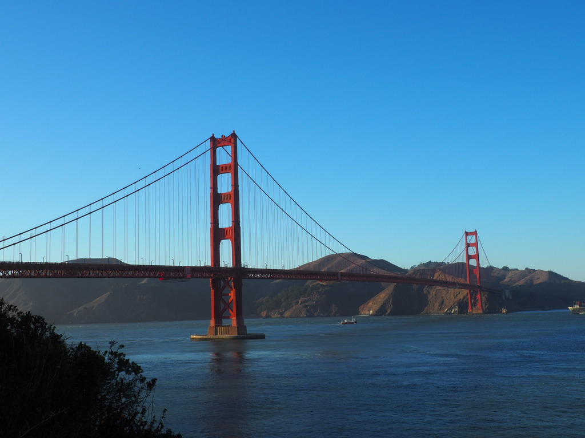

Podobno jadąc do **San Francisco** trzeba się upewnić, że ma się wplecione kwiaty we włosy. Kolorowa, słoneczna kraina. Trzeba tylko uważać, żeby kwiatów nie potargał wiatr.

Ludzi z potarganymi kwiatami zobaczyliśmy już tuż po przyjeździe. Lądowaliśmy przedwczoraj w Oakland. Miasto sąsiadujące i niemalże złączone z San Francisco. Dzieli je tylko zatoka. Miasto mistrzów NBA. W ostatnich czterech sezonach nie wygrali tylko raz. Niemniej przenoszą się po tym sezonie do San Francisco. Blink blink, miedialność góruje. Jadąc też kolejką z lotniska w Oakland do San Francisco widać coś innego co rzuca się w oczy - bezdomność i slumsy. Mnóstwo ludzi, którym dawno wiatr wytargał wszystkie kwiaty z włosów.

Ciężko jest oceniać będąc dosłownie przelotem w USA, żeby oceniać trzeba by było trochę tutaj pożyć. Nie znam się, to się wypowiem. To co rzuca się mocno, szczególnie w San Francisco, to nierówności społeczne. Ludzie nauczyli się nie widzieć **bezdomności**. Nie trzeba wchodzić w ciemne, szemrane uliczki, żeby zobaczyć prowizoryczne legowisko zrobione przez bezdomnego. Dziwacy chodzący, gadający do siebie. Kolesie w metrze wygłaszający mowy o tym, że jesteśmy sterowani mikrofalami z komórek. Poszarpaniec siedzący na środku ruchliwego chodnika wstrzykujący sobie coś w kolano. Niepełnosprawni ludzie na wózkach, wożący na nich swój cały dobytek. W Nowym Jorku było tego dużo, ale tutaj w San Francisco jest nawet więcej. Słonce świeci, wiaterek wieje, grupa ludzi uprawia fitness na placu przed ratuszem, a tuż obok śpi człowiek pozawijany w łachmany. Stabilna temperatura tutaj zdaje się sprzyja włóczęgostwu, zimą się nie zamarznie. 

Nierówności nie dotyczą tylko samej skrajnej biedy. Życie tutaj nie jest lekkie. Imigranci zbudowali ten kraj swoją ciężką pracą. Teraz dalej muszą ciężko zapracować na to by być regularnym obywatelem. Szczególnie w dużych miastach. Nasza przewodniczka opowiadała, że poza tą pracą jest również wieczorami krupierką w kasynie. Zarówno w Bostonie jak i San Francisco widzieliśmy strajk pikiety pracowników pod hotelami domagającymi się ludzkich zarobków. Hasłem przewodnim było wymowne "Jedna praca powinna być wystarczająca". Długie dojazdy do pracy, długa praca, tak to wygląda. W USA jak nie pracujesz to jesteś w pewnym ciemnym miejscu. Nie masz za co opłacić ubezpieczenia, nie masz za co zapłacić kredytu, wylatujesz poza nawias, a razem z Tobą kwiaty z Twoich włosów.

Także kraje kapitalistyczne mają swoje minusy, ale chodzi o to, żeby te minusy nie przesłoniły Wam całkiem plusów, które niewątpliwie tutaj są. San Francisco jest faktycznie bardzo ładne, a my ciężko pracujemy w nim na opinię samozwanczych wakacyjnych świrów. Po przylocie i zameldowaniu się w hostelu ledwo powłóczyliśmy nogami, a oczom przydałyby się zapałki. Zmotywowaliśmy się jednak i nie żałowaliśmy. Ruszyliśmy słynnym tramwajem, a w zasadzie **Cable Car**. Tutaj pierwsza niespodzianka, to nie jest tramwaj jakiego znamy. Nie jest on napędzany na prąd. Są to wagoniki, które ciągnięte są przez stalową linę. Technika ta sama jak kolejka liniowa na Kasprowy Wierch. Różnica jest taka, że nie znajduje się nad wagonem, tylko jest schowana w tuneliku pod nim. Porównanie z tatrzanska kolejką liniową jest tym bliższe, bo nasz tramwaj jedzie po górkach. Jak każde dziecko bowiem wie, San Francisco położone jest malowniczo na wzniesieniach. Żeby pojechać kolejką, oczywiście najpierw należy swoje odstać w kolejce, ale warto. Bo można pojechać otwartym wagonie, część osób nawet musi stać na jego zewnątrz trzymając się mocno poręczy.

Mknąc po górkach, mijając podobno najstarsze Chinatown w stanach, Lombard Street docieramy do **Fisherman's Warf**. Jest to dzielnica portowa, ciągle czynna i działająca, ale na wpół turystyczna. Znajdziesz tutaj sporo knajpek, a w nich lokalny przysmak - **Clam Chowder**. Jest to pożywna zupa z mięczaków, na śmietanie, podawana tutaj tradycyjnie w chlebku (jak nasz żurek). Każda restauracja szczyci się tutaj tym, że podaje najlepszą. My osobiście polecamy zjeść ze street foodowych miejscówek. Można zamówić sobie je niemalże na ulicy - fajny klimat, zupa wyśmienita. Szczególnie na wieczorny chłodek.

Zanim jednak ogrzaliśmy się przy chowder zrealizowaliśmy jeden z najważniejszych punktów naszego wyjazdu. W każdym razie dla Diany. Każdego możliwego amerykanina, z którym rozmawialiśmy pytała się o to, czy w San Francisco można zobaczyć **uchatki**. Okazało się, że nie można. Ale można za to zobaczyć **lwy morskie**. Siedzą sobie one w dużej liczbie właśnie w Fisherman's Warf, **Pier 39**. Wesołe to zwierzęta, hałaśliwe, nieco śmierdzące. Część z nich byczy się na pomostach, część bawi się w spychanie się z nich. Super sprawa, Diana była w niebowzięta.

Koncząc nasz dzien z przytupem weszliśmy jeszcze pod górę Lombard Street. Słynnej pokręconej ulicy. Nie mogą tutaj wjeżdżać pojazdy z więcej niż 8 osobami. Parkować trzeba pod kątem 90 stopni. Ja to ogólnie nie wyobrażam sobie tam podjeżdżać. Niesamowity widok. Potem podążyliśmy dalej w przeciwną stronę, idąc wzdłuż stukającej i piszczącej linii kolejki. Minęliśmy Chinatown, wspomniane wcześniej protesty i wróciliśmy do hostelu. Padając na twarz, a w zasadzie to na łóżko tak jak staliśmy.

Pobudka dnia następnego o 8:30. Bardzo sympatyczne śniadanie w hostelu - można samemu sobie usmażyć pancakes z przygotowanego przez obsługę ciasta. No i po lekkim grzebaniu się wyjście dalej. Wakacyjne świry, rozumiecie. Trasa wyznaczona skromnie, ha ha, 19km. Wyszło 23. Mimo kolejnego lekkiego przesilenia - lecimy dalej!

A więc w telegraficznym skrócie. 

Civic Center, czyli wielki plac a na nim urzędowo, kulturalne ośrodki. Znajdują się tam m.in. Ratusz, Budynek Stanowy, Opera, Muzeum Sztuki Chinskiej i kilka innych atrakcji.

Po drodze siedziby główne Twittera i Ubera. W koncu San Francisco to stolica IT. Sillicon Valey, te sprawy.

Kolejny cel to tzw. dzielnica latynoska, która się jednak okazała nie bardzo latynoską. No może poza kościołami i **Mission High School**. Liczyłem na dobre burritos albo quesadillę. Zawiodłem się niestety. Mimo rekomendacji obserwowanej przez Dianę bloggerki nic takowego nie znalazłem. Nie wierzcie bloggerom, kłamią. Dzielnica jednak jest prześliczna, kolorowe domy jak z pocztówek i przede wszystkim **Mission Dolores Park**. Malowniczo położony park z panoramą na San Francisco. Znaleźliśmy tam rzadką chwilę na złapanie oddechu leżąc na trawce. No ale cóż, trzeba pędzić dalej, nie przestawać! Po co siedzieć jak można iść!

Ruszyliśmy dalej do Castro. Tęczowej dzielnicy. Światowego Centrum LGBT. Tutaj nawet pasy na jezdni są kolorowe. Poza tym mnóstwo knajpek. Tutaj działał Harvey Milk, którego świetnie sportretował Sean Penn.

Cel kolejny - podróż do przeszłości. Wspomnienia z dziecinstwa stają się rzeczywistością, czyli **Pełna Chata**! Najpierw **Alamo Park** i **Painted Ladies**. Tutaj Fullerowie robili piknik w czołówce serialu. Słynne kolorowe domki, ustawione jeden obok drugiego. Idziemy trochę dalej, na **1709 Broderick Street** - tutaj mieszkali Fullerowie. A w zasadzie ten budynek robił za jego front, bo sam serial kręcony oczywiście był w studiu. Aktualnie budynek jest remontowany. Nie można było zrobić sobie zdjęcia na schodach. Ale i tak było bosko, kto nie kochał Pełnej Chaty? Nie ma takich ludzi.

Następny cel mógł być tylko jeden - **Most Golden Gate**. Szliśmy kolejno California Street, Presidio Avenue, Lincoln Bulevard aż doszliśmy na słynny punkt widokowy: **Crissy Field Avenue**. Mieliśmy szczęście, bo pogoda była wspaniała, słoneczko, leciutki wiaterek. Podobno większość czasu most jest za mgłą, my na szczęście zamówiliśmy za wczasu pogodę, więc nie mieliśmy takich problemów. Seria zdjęć, spacer plażą, zbliżający powoli zachód słónca. Magiczne miejsce. Potem przejście przez Most. Trwa ono sporo, bo bez zdjęć i pozowania, dobrym tempem to jakieś 25-30m. 

Po drugiej stronie zrobiliśmy sobie odpoczynek, obserwowaliśmy jak słonce znika, a pojawiają się nocne światła miasta i ruszyliśmy z powrotem. Liczyliśmy, że uda nam się złapać autobus po drugiej stronie mostu, ale nie udało się, więc ponownie drepcząc już z trudem ruszliśmy ponownie przez Most. Po drugiej stronie złapliśmy autobus, jakimś cudem przesiadliśmy się i wróciliśmy wymęczeni do hostelu.

Zatem jak jest w San Francisco? Póki co mieszane uczucia. Z jednej strony górki, krajobrazy, architektura, wszystko to jest piękne. Z drugiej strony brud, smród moczu, bezdomni jednak sprawia, że odczucia są niejednoznaczne. Dysonans poznawczy. Mamy jeszcze dwa dni, żeby to rozgryźć. Konczę pisanie, zbieram się i ruszamy dalej. Zobaczymy jak bardzo będą potargane kwiaty w naszych włosach.