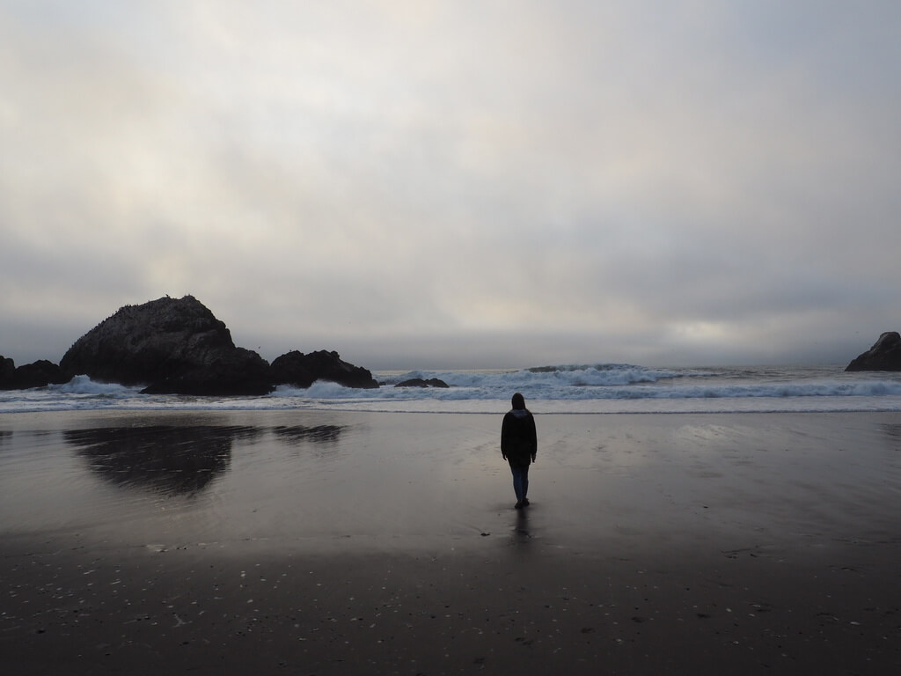

Rozterki naszych pierwszych dni w San Francisco już znacie z [poprzedniego wpisu](/kwiaty-we-wlosach). Nieco podmęczeni dodatkowo ciągle trapiącym nas bostonskim przeziębieniem jednak nie poddawaliśmy się. Zwolniliśmy nieco. Tym razem nie łaziliśmy całej drogi do punktu docelowego, sprawdziliśmy komunikację miejską.

Kilka słów najpierw na jej temat. Jak pewnie wiecie, nie mamy prawa jazdy. Podchodziliśmy, ale zabrakło trochę motywacji, trochę umiejętności. Może się to zmieni niedługo, ale póki co nie mamy. Czy nam to przeszkadza? Raczej nie na tyle, żeby jednak się zmotywować i w koncu to zrobić. Przed wyjazdem często słyszęliśmy "Jak sobie poradzicie bez samochodu?", "Stany bez prawa jazdy? Będzie ciężko". Być może to nasze przyzwyczajenie, ale do tej pory nie odczuliśmy problemów z tym związanych... No prawie - do przyjazdu do Kalifornii. Nowy Jork i Boston ma bardzo dobrze rozwiniętą linię metra. Do najważniejszych punktów turystycznych można się tam dostać. Boston to w ogóle, podobnie jak Las Vegas większość ma ich umieszczonych w jednym miejscu. Kupujesz kartę, doładowujesz ją i możesz używać. Płacisz jak jedziesz. Doładowac możesz go w każdym punkcie metra.

W San Francisco i (Los Angeles, bo pisze już ten wpis z niego) - nie jest tak sympatycznie. Pierwszy zakup biletu to już same problemy. Kupiłem kartę, doładowałem ją - minimalna kwota już wysoka - 20 dolców. Okazało się, że nie można jej dzielić na dwie osoby. Diana przeszła przez bramki ja zostałem po drugiej stronie. Okazało się, że muszę kupić drugą. Niestety nie mogłem jej kupić kartą kredytową, bo zapłaciłem nią za poprzednią kartę miejską... Na szczęście miałem jakieś papierowe i za nią zapłaciłem. Potem jeszcze okazało się, że jedne automaty są do metra, inne do komunikacji miejskiej. Ja straciłem 6 dolców bo przez pomyłkę bilet nie na ten środek komunikacji co trzeba. Automatów do doładowania praktycznie nie ma, można podobno w sieci aptekosklepów Wallgreens, które oczywiście tez nie są na każdym rogu... Możesz niby kupić w automacie koło kierowcy, ale musisz mieć wyliczone drobne, bo automat Ci reszty nie wyda.

Pierwszą zasadą poruszania się komunikacją miejską jest: unikać autobusów. Jeśli jest metro lub tramwaje - wybierz je. Dlaczego? Bo stoją w korkach. Ta reguła się nie sprawdza w San Francisco. Tramwaje tutaj - nie polecam. Nawet starsza pani w tramwaju powiedziała, że jest to najwolniejszy środek transportu.

Wracając do naszych przejazdów. Dzien po naszym sprincie turystycznym postanowiliśmy poobcować nieco z przyrodą. Pierwotnym naszym planem był Park Yosemite, ale ostatecznie zrezygnowaliśmy bo cena wycieczki była duża, a nam aż tak nie zależało. Chcieliśmy jedynie zobaczyć sekwoje, ale nie aż tak bardzo. Powetowaliśmy sobie to wyprawą na **Lands End**. Jest to cypel umieszczony w północno-zachodniej części San Francisco. Znajduje się tam nieco dziki i mniej uczęszczany szlak turystyczny. Dostaliśmy się tam autobusem, ja na gapę, bo nie miałem gdzie doładować karty. Autobus zatrzymywał się chyba na każdym skrzyżowaniu i podróż trwała prawie godzinę... Ale było warto.

Podróż zaczyna się przy muzeum zwanym **Legion of Honor**. Ciekawy klasycystyczny budynek, cyknęliśmy fotki, poszliśmy dalej - nie był to cel naszej wyprawy. Minęliśmy efektownie położone pole golfowe i rozpoczęliśmy naszą właściwą trasę. Granie w golfa mając widok na Golden Gate i zatokę musi być w koncu efektowne.

Szlak do Lands End biegnie góra dół, dół góra. Mnóstwo chodzenia schodkami, momentami czujesz się jak na zawodach wbiegania na ostatnie piętro jakiegoś wieżowca. Tylko bardziej niebezpieczną. Klify są strome i wysokie, w niektórych miejscach ograniczone linami i tabliczkami ostrzegającymi, że ten fragment jest zamknięty, bo ludzie zdążyli już tam pospadać. No ale ogólnie trasa nie jest straszna, polecam każdemu. Kontrastuje ze zgiełkiem miasta, przyroda, piękne widoki, piękne plaże. 

Na samym Lands End znajdziesz charakterystyczny ułożony z kamyków mini labirynt oraz piękny widok na zatokę. 

Polecamy też zejść na **Mile Rock Beach**. Zgodnie z nazwą olbrzymie kamienie tworzą tam krajobraz niczym z kosmosu.

Wracając na szlak można pójść dalej minąć legendarny **Cliff House** - budynek, od którego zaczyna się San Francisco i dotrzeć do **Ocean Beach**. Długa, szeroka i piaszczysta plaża. Otworzyliśmy tam piwko, zagryźliśmy nachosami i cieszyliśmy się chwilą. Nie trwało to niestety długo, bo zaczęło się ochładzać i szybko dopadła nas słynna mgła z San Francisco. Nie zostało nam nic innego jak zmoczyć dłonie w Pacyfiku i potłuc się autobusem z powrotem. Mimo nieprzyjemności komunikacji miejskiej był to naprawdę fajny dzien.

Kolejny dzien również spędziliśmy blisko morza. Rozpoczęliśmy od podróży tramwajem, która prawdopodobnie trwała tyle, że na piechotę byśmy dotarli szybciej. Gdzie podróżowaliśmy? Do wspomnianego już w [poprzednim wpisie](/kwiaty-we-wlosach) **Fisherman's Warf**, a z niego do **Alcatraz**. Alcatraz widzieliśmy już z brzegu, jest to punkt krajobrazu, który nie da się zignorować patrząc z perspektywy San Francisco. Tak samo w drugą stronę. Podobno możliwość zobaczenia San Francisco przez malutkie okienka spacerniaka była dla samych więźniów dodatkową karą. Widzieli ciągle co tracą. Mieli to wszystko niemalże na wyciągnięcie ręki, ale jednak ciągle nieosiągalne.

Historia Alcatraz dzieli się na trzy główne etapy. W pierwszym ta kamienna wyspa, zwana oryginalnie "Wyspą ptaków wodnych" została zamieniona w siedzibę fortu wojskowego. Miał on w czasach gorączki złota, potem wojny z Hiszpanami (o Meksyk) oraz Wojny Secesyjnej bronić zatoki oraz samego San Francisco. W szczytowej formie miał on 105 dział. Czas jednak mijał, garnizon nie był specjalnie unowocześniany. Przeprowadzono test, w którym armaty miały ostrzeliwac statek. Na 400 kul nie trafiono ani jedną. Ostatecznie wojskowi doszli do wniosku, że szansa na to, że San Francisco zostanie jest niemalże zerowa, a koszty zbyt duże i przekwalifikowali je na więzienie wojskowe. Ostatecznie w roku 1933 zostało przekwalifikowane na Federalny Zakład Penitencjarny. Specjalny zakład karny - dla najgroźniejszych przestępców. Siedzieli tam m.in. Al Capone, "Birdman", George "Machine Gun" Kelly i inni zwyrodnialcy. Na dzien dobry słyszeli:

"Witamy w Alcatraz. Masz prawo do jedzenia, ubrania, schronienia i opieki medycznej. Inne rzeczy które otrzymasz są przywilejem".

Szczególnie w początkowych latach więźniowie nie mieli lekko. Byli traktowani tak jak na to zasłużyli swoim postępowaniem. Zwykle nawet gorzej. Mimo tego, że ucieczka była niemożliwa, to niektórzy próbowali. Sforsowanie murów, następnie zimnych i mocnych prądów zatoki było praktycznie niemożliwe. Nieliczni jednak próbowali. Większość z nich została pojmana, lub zginęła. Najbardziej efektowna była ucieczka z 1962 roku sportretowana w słynnym filmie z Clintem Eastwoodem oraz będąca inspiracją dla Skazanych na Shawshank. Do dziś nie potwierdzone jest czy trzem uciekinierom się udało czy nie. Niektórzy twierdzą, że żyją w Brazylii. Możesz ich poszukać. Nagroda 3 miliony dolarów ciągle do zgarnięcia.

Więzienie zamknięto w roku 1963 jako za drogie. 

Ostatnim etapem i najmniej znanym etapem jest indianska okupacja wyspy. Tak, dokładnie. I to nie w czasach dzikiego zachodu tylko w latach 1968-1970. Grupa aktywistów z różnych plemion chciała utworzyć na opuszczonej wyspie swoją enklawę. Uznali, że skalista wyspa, bez wody, bez jedzenia nie będzie białemu człowiekowi potrzebna, a im da szansę zamanifestowania w głośny sposób swoich rządan. Nie muszę dodawać, tego że San Francisco było w tamtym czasie stolicą hippisowskich idei. Sami dzisiaj przyznają, że byli bandą dzieciaków żyjącą nieralnymi marzeniami. Dzieciaków wytrwałych, okupowali wyspę przez 19 miesięcy przy cichym przyzwoleniu prezydenta Nixona. Ostatecznie zostali z niej usunięci przez FBI w roku 1970. Czy ich wysiłek poszedł na marne? Nie do konca, zainspirował on innych aktywistów do większej odwagi. Pokłosiem tego było złagodzenie stanowiska rządu USA i przydzielenie im większych swobód, autonomii oraz [rezerwatów](/kanion-na-trzy-sposoby). Znaki ich nieposłuszenstwa widoczne są do dziś nie tylko na budynkach w Alcatraz.

Jak prezentuje się to teraz? Jest to niewątpliwie jedna z najpopularniejszych atrakcji San Francisco. Nieco podniszczona, ale ciągle efektowna. Warto odwiedzić, trzeba uważać, żeby nie przesadzić i nie spędzić tak jak my tam 3 godzin (1.5-2h powinny być ok). Pamiętajcie też o zarezerwowaniu biletów przez Internet z wyprzedzeniem. Z dnia na dzien nie kupicie.

Odwiedziliśmy też stację promów wodnych zamienioną teraz w hipsterskie targowisko. Ciekawe, ale dla mnie osobiście trochę przerysowane.

Pobyt skonczyliśmy tak jak zaczęliśmy. 

Pożegnaliśmy się z lwami morskimi w Pier 39.

Weszliśmy pod górę Lombard Street. Tym razem w dzien.

Wróciliśmy naszym tramwajem, czy też kolejką liniową do hostelu.

Kolejny dzien to ponownie pobudka o 5:30. Uber na lotnisko i lot do Los Angeles.

Ale o tym już w kolejnym wpisie.