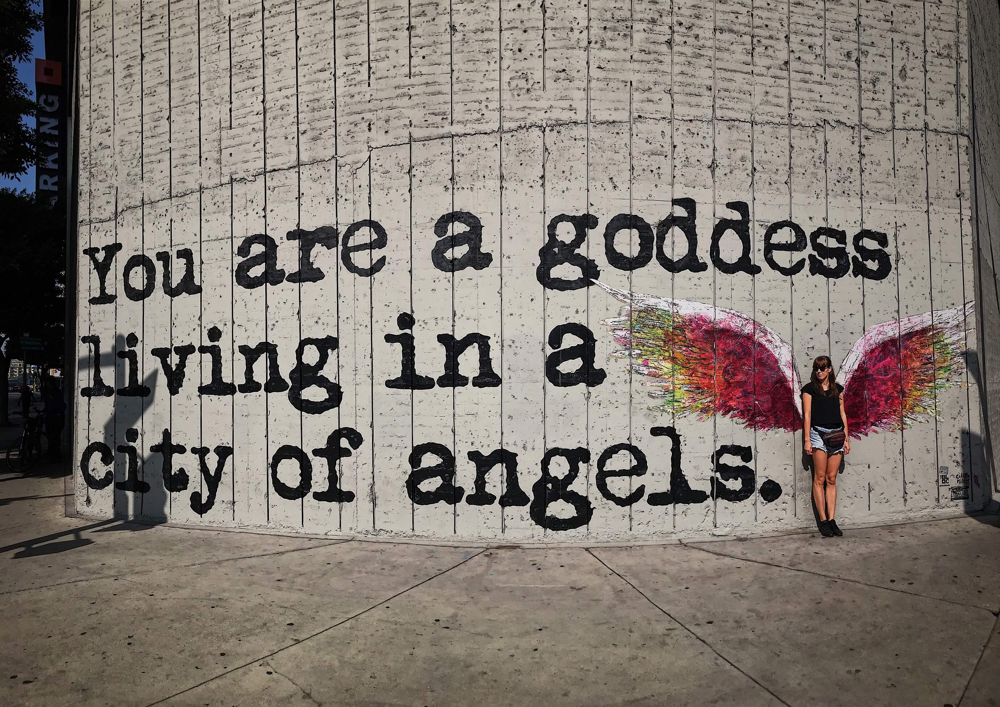

City of stars, are you shining just for me?

Żyjemy w czasach, w których każdy może mieć swoje pięć minut. Każdy może zostać bloggerem, zdobyć 100 lajków na Facebooku, 1000 serduszek na Instragramie. Każdy z nas może być w czymś najlepszy, choćby przez te kilka minut. Szybciej, więcej. Dzisiaj jesteś gwiazdą, jutro nikt o tym nie pamięta. Gwiazdy same w sobie są specyficzne, świecą cały czas, ale nielicząc jednej nam najbliższej ich blask widzimy tylko chwilę. Pół doby maksymalnie. Umiesz na nieboskłonie odnaleźć Wielką Niedźwiedzicę? Żyjemy w ciekawych czasach, nie?

Czternastego października 1978 roku grupa Village People wydaje swój singile "Y.M.C.A" po wsze czasy łącząc ten skrót z wizerunkiem geja harlejowca rodem z klubu "Błękitna Ostryga". Niewielu u nas pamięta co tak naprawdę oznacza ten skrót. Young Man Christian Associtation (Związek Chrześcijańskiej Młodzieży Męskiej). Związek istnieje do dziś zajmując się krzewieniem kultury fizycznej i umysłowej oraz wartości chrześcijanskich - również w Polsce. Jeszcze mniej osób wie, że istnieje również YWCA. Związak analogiczny - tylko kobiecy.

W 1893 roku w Los Angeles jedenaście kobiet spotyka się pierwszy raz na spotkaniu YMCA w kościele metodystów na Broadway. Los Angeles ma wtedy koło 50 tysięcy mieszkancow. Trochę więcej niż Kołobrzego obecnie. Broadway (Szeroka droga) to swoją drogą popularna nazwa ulicy w Stanach. Każde większe miasto ma taką. Ta z Miasta Aniołów znajduje się w Downtown. Samym środku miasta. 

Los Angeles rozwija się prężnie. Nadmorska lokalizacja oraz ciepły klimat sprzyja temu. Downtown tętni życiem, to w nim splatają się szlaki kolejowe oraz drogowe. Same stany dynamicznie się rozwijają. Na początku dwudziestego wieku szczególną popularność zaczyna zdobywać kinematografia. Centrum wydarzen jednak ciągle znajduje się na wschodnim wybrzeżu. Większość patentów na umożliwiających nagrywanie i odtwarzanie filmów należy do Thomasa Edisona. Utrudnia to rozwój kinematografii oraz zwiększa jej koszty.

W 1887 roku powstaje osiedle Hollywood. W 1900 roku Beverly Hills. Obydwa w założeniu mają być miejscem dla dobrych chrześcijan. Dobry chrześcijanin oczywiście nie powinien wynajmować lub sprzedawać domu Żydowi, więc jest to zabrionione. Nie powinien pić alkoholu i zażywać takich niegodziwych rozrywek jak oglądanie filmów. Także sprzedaży alkoholu i budowania kin w tych osiedlach też zabroniono. Tak kin w Hollywood. Los Angeles w roku 1900 ma już 102 tysiące mieszkancow. Podwaja się od czasu pamiętnego spotkania 11 pobożnych kobiet.

Tak, w ciągu 7 lat liczba mieszkancow się podwaja. I będzie kontynuować 1910 rok to już 319 tysięcy mieszkancow, 1920 - 576 tysięcy, 1930 - 1238 tysięcy. Łał. Jak do tego dojdzie? Los Angeles staje się ziemią obiecaną. Fabryki, stocznie, finansiści, ale nie tylko. To tutaj znajduje swoją szansę branża filmowa. Ucieka od prawa patentowego Thomasa Edisona, znajduje ciepłe miejsce ze zróżnicowanym krajobrazem pozwalającym kręcić różne obrazy.

Co słychać w Hollywood i Beverly Hills? Wraz z utratą władzy pierwotnych założycieli zmieniają się też początkowe idealistyczne prawa. Hollywood zostaje włączone w 1910 roku do Los Angeles wraz z istniejącymi już w tym czasie tam 10 wytwórniami filmowymi. Beverly Hills nie chce być częścią Los Angeles. Mieszkające już tam wtedy gwiazdy filmowe chcą zachować jego status jako zacisznego schronienia. Bez gapiów oraz rozgłosu dla ich ekscesów, których już wtedy nie brakuje. Beverly Hills nie jest częścią Los Angeles do dziś. Mimo, że możesz tego nawet nie zauważyć.

Czasy są dynamiczne. Purytanski charakter stanów zaczyna się chwiać. Zarządzający nimi, próbują z tym walczyć na siłę wprowadzając w 1919 prohibicję. Zaledwie rok później kobietom udaje się przełamać pierwszą tamę - uchwalona zostaje 19 poprawka do Konstytucji Stanów Zjednoczonych - kobiety dostają prawo głosu. Tak, nie minęło jeszcze nawet 100 lat od tego czasu. Światła demokracja.

A co słychać w Downtown? Broadway z Miasta Aniołów dorównuje temu z Nowego Jorku. Powstają tam słynne teatry i kina: "Million Dolar Theater", "Palace Theater", a w kolejnych latach kolejne. Sam Downtown nazywany jest nie bez przyczyn Wall Street zachodu.

Mamy lata dwudzieste dwudziestego wieku. Downtown i Hollywood mają swoje pięć minut. Piękna architektura, wspaniałe kina, gwiazdy świecą jak nigdy. 

W 1926 roku, u szczytu potęgi Downtown, przy ulicy Figueroa rozpoczęta zostaje niecodzienna inicjatywa. Pod opieką YWCA i dzięki ich olbrzymiej zbiórce i kredytowi powstaje hotel od kobiet dla kobiet. Prawa głosu tylko potwierdziły to co było faktem. Coraz więcej kobiet pracowało w biurach, coraz więcej pojawiało się business women. Coraz więcej z nich potrzebowało podróżować w interesach. Czasy jednak nie były idealne, ciągle nie są. Samotna kobieta w podróży była narażona na zbyt wiele niebezpieczenstw. Szczególnie w hotelach. Na te potrzeby miał odpowiedzieć Hotel Figueroa. Zarządzany przez stalową kobietę Maude N. Boldin. Hotel feministyczny. Mężczyźni mogli nocować w nim tylko na wyizolowanych dwóch pierwszych piętrach. Inicjatywa zdecydowanie wyprzedzająca czasy.

Rok 2018, październik. W ostatnim etapie naszej amerykanskiej podróży lądujemy w Hotelu Figueroa, w Downtown. Piękne wnętrza w stylu Art Deco. Na biurku koło barku znajdujemy pudełeczko. Love kit - a w nim lubrykant, mini wibrator na baterie. Uśmiechamy się lekko. Zestaw silnej, niezależnej kobiety.

Ruszamy do Beverly Hills, kod pocztowy 90210. Witamy 100 letni znak. 

Docieramy na koniec do Hotelu Beverly Hills - słynnego Hotelu Callifornia.

Mijamy wille, pięknie utrzymane ogródki, palmy przy drodze. Słynny Beverly Hills Boulevard. Nie widzimy co prawda Jennifer Anniston, ale jednak czuć piniądz.

Czy przez te ostatnie 100 lat nic się nie zmieniło?

Można by tak ocenić, ale jednak nadzwyczajny spokój jaki nas zastał w Downtown budzi podejrzenia. Co prawda jest niedziela, dzielnica ewidentnie biznesowa, więc może po prostu ludzie sobie oddzielają życie prywatne od zawodowego? Mała ilość knajpek jednak budzi w nas podejrzenia - skoro pracują, to chociaż w tygodniu powinni mieć gdzie wyskoczyć na lunch.

Następnego dnia jedziemy do Hollywood. Tutaj już prawdziwa tragedia. Tandeta, brud. Co prawda możesz zrobić sobie zdjęcie z Edwardem Nożycorękim, Spidermanem, czy zobaczyć Supermana wracającego z zakupów. Jednak to sprawia wrażenie takiego Pobierowa sprzed 10 lat. Stoiska z badziewiem, żebracy. To co robi tylko wielkie wrażenie to znajdująca się przed kinem **Chinese Theatre** galeria sław Hollywood. No prawie, jest też tam odcisk dłoni i buta Vina Diesela... Pozostałe jednak robią wielkie wrażenie Marilyn Monroe, Rita Hayworth, Humprey Bogart czy też młodsi Quentin Tarantino i mój ulubiony podpis Arnolda Shwarzenegera. 

Poza tym jednak tandeta. Gdzie ten glamour? Gdzie ten szyk, styl, gwiazdy? Można powiedzieć, że dotknęły bruku, bo tylko na nim idąc Hollywood Boulevard można je obecnie zobaczyć...

Szukamy jednak gwiazd dalej, ruszamy wspinaczką do słynnego Griffin Observatory. Tak, te obserwatorium znane z La La Land. Niestety tam gwiazd nie zobaczymy, bo źle wymierzamy z terminem - okazuje się, że w poniedziałki jest zamknięte. Widok na Los Angeles jest również zamglony. Pozostaje nam jedynie cieszyć się architekturą obserwatorium oraz przyrody i widoków, które zażywamy w trakcie wspinaczki.

Zatem co się stało z Hollywood? Co stało się z Downtown? Kto zabił królika Rogera?

To co wyniosło te dzielnice na szczyt sławy sprawiło, że z tego szczytu spadły. Los Angeles dalej rozwijało się dynamicznie, niemalże skokowo. Wchłaniało kolejne miejscowości jako swoje dzielnice. Miasto rozwijało się płasko. Dzisiaj nawet mając ponad dwa razy mniej mieszkanców niż Nowy Jork, ma o 20% większą powierzchnię. Jest duże, jest płaskie. 

Dowtown stając się centrum finansjery stało się bardzo drogą dzielnicą. Mieszkancy zaczęli się przenosić poza nią. Bloki mieszkalne pustoszały i niszczały. Ludzie ciągle musieli docierać do pracy. Rozwój motoryzacji sprawił, że ludzie dojeżdżali coraz więcej samochodami. Z tego powodu wyburzono część zabytkowychm ale opustoszałych i zniszczonychm budynków zastępując je piętrowymi parkingami. Centrum finansowe też się przesunęło poza Downtown. Ponieważ ludzie tutaj tylko pracowali to oferta kulturalna nie była już taka potrzebna. Kina zamykano, w budynkach zamieszkał podejrzany element.

To samo dotknęło Hollywood. Kino się spouplaryzowało. Okazało się świetnym biznesem, więc budowano kina tam gdzie ludzie mieszkali. Nie było już takiej potrzeby by jechać specjalnie do Hollywood. Ceny gruntów też wzrosły, więc wytwórnie powynosiły się poza dzielnicę. Do tego trzęsienia ziemi, wyburzenia słynnych budynków sprawiły, że łatwiej było dostać tutaj kulkę lub w zęby niż spotkać gwiazdę.

Hotel Figueroa też stracił swój blask. Był zamykany, stracił swój pierwotny charakter. Tak jak całe Downtown. 

Dobre gwiazdy przestały świecić.

Downtown i Hollywood otrzymały swoje programy rewitalizacji. Mnóstwo pieniędzy jest wkładanych by dzielnice ponownie wrócić miastu.

Dwa lata temu Hotel Figueroa został ponownie otwarty. Charakterystyczny napis na jego szczycie ponownie zaświecił. Dalej mocnym elementem hotelu są kobiety. Widoczne są w obrazach w załodze, pokojach, wystroju łazienki. Czy też choćby w zawartości Love Kit.

 Dawny blask raczej już nie wróci, ale może nowe gwiazdyy jeszcze zaświecą.

 A jeśli nie zaświecą?
 
 To nie ma co płakać. 
 
 Pięć minut sławy to i tak więcej niż niektórzy dostają.