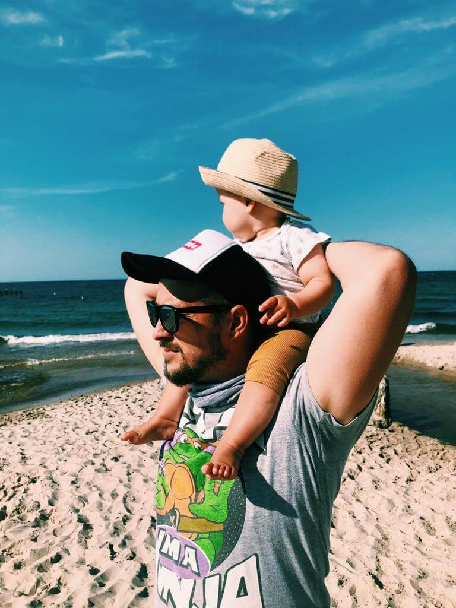
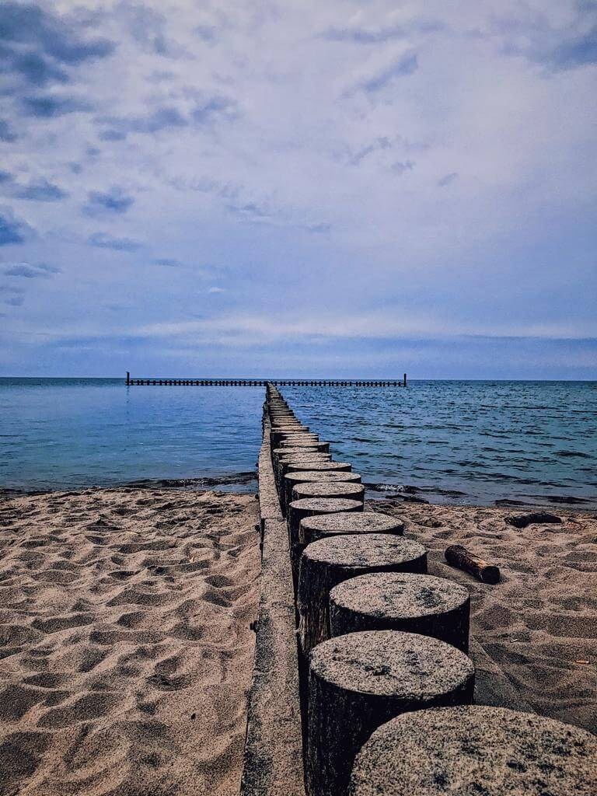
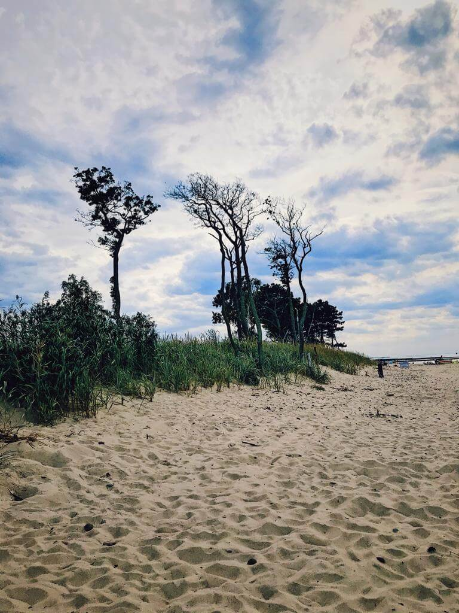
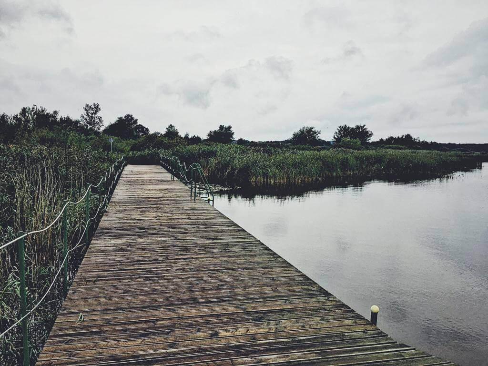
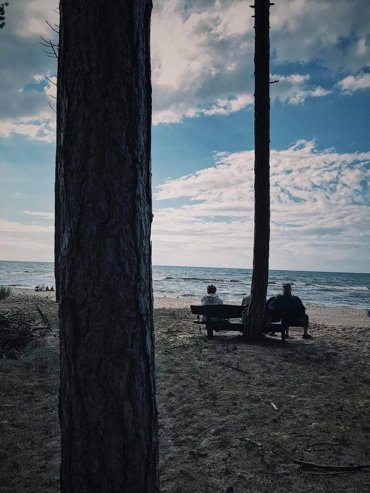

Pierwsze wakacje czas start
Jarosławiec, nad morzem.
Gdzie to w ogóle jest? Mąż dzień przed wyjazdem zerknął dopiero na mapę.
Ważne że jest morze.
Wyjazd nie w pojedynkę, w znaczeniu 2+1 tylko z ekipą przyjaciół. Oferta dojazdu nie do odrzucenia. Dzięki Łukasz.
Pakowanie
Dla mnie nigdy ono nie było ulubionym zajęciem. W przeciwieństwie do pakowania się Szanownego Małżonka.
Skarpety, gacie, tshirtów tyle ile dni trwa wyjazd, co to za filozofia. 5 minut i po sprawie.
Pakowanie z dzieckiem to nieco wyższy level.
Dobrym rozwiązaniem byłoby kupno podstawowych produktów na miejscu a zabranie tylko tych niezbędnych.
W końcu nie jedziemy na koniec świata.
A szkoda, może w przyszłości.
Nasza Obywatelka jest jednak dzieckiem kosmetykowo wymagającym.
Podam tylko jeden przykład: pieluchy dostępne tylko w sklepach internetowych prosto ze Skandynawii.
Wiec ta opcja z pakowaniem póki co nas nie dotyczy.
Zaczynamy wiec pakowanie.
Dużo tego.
Podzial ról przy pakowaniu prawie od zawsze taki sam, ja wybieram co bierzemy, gromadzę w jednym miejscu a Oskar tak to jakoś zawsze kompresuje , niemalże próżniowe pakowanie, że zawsze to jakoś zgrabnie wygląda. 
Tym razem nieco mniej ale chyba jednak nie najgorzej . Taką opinie wydała jednak mama dwójki dzieci podróżująca rok w rok nad morze, więc chyba się zna.
Tu fota

Zapakowani po dach ruszamy.
Pora wyjazdu i tu MaDki się rozpisują na blogach, za dnia czy w nocy, na pierwszą czy ostatnią drzemkę itp.
Dystans nie mały bo jakieś 450 km wiec wzorując się na ostatniej podróży, startujemy zaraz z rana po porannej toalecie tj g. 8
Matka jedzie z tyłu, decyzja obojga nas.
Podróż raczej bez komplikacji raczej z miłą nawet niespodzianką bo na pierwszym postoju spotykamy znajomych wracających do swojego domu.
Zabawa - drzemka- postój na dość nietypowej stacji tak jakby czas się na niej zatrzymał , ekspres do kawy się zepsuł ale zasada włacz wyłącz urządzenie nie zawiodła.
Kanapka domowa , kawa na krawężniku, rozprostowanie nóg i ruszamy dalej , druga drzemka , zabawa i już na miejscu.

Trasa malownicza, kręta i zielona - przyjemnie.
Zaczynamy „wczasy”.
Miejscówka super, widać z balkonu morze i plaże, jedną z niewielu w Europie z tych sztucznie usypanych o egzotycznej nazwie Dubaj. Widać też piękny, drewniany domek, chyba nawet zabytek - uroczy aż szkoda, że to w nim nie spędzamy pobytu.
No ładnie, nie powiem.

I na tym ta ładność Jarosławca chyba się kończy.
Chyba czy może na pewno ?!
Jako, że nasz rytm dnia dyktowany jest głównie przez naszą Małą Obywatelkę dotychczasowa forma wakacji zmienia wymiar .
Jak to pogodzić?
Odpocząć a zarazem wykonywać codzienne rytuały!? Czy da się ?
Raczej słabo , no chyba, że jeszcze się tego albo nauczymy albo Obywatelka nam w tym pomoże i nieco zmieni swoje potrzeby np. Przeskakując na jedną drzemkę w ciagu dnia.
We will see
Ten kto nas zna albo obserwuje wie że trzaskamy kilometry jak nienormalni.
Drzemki Obywatelki mają swoje wytyczne:
⁃ musi być ruch, czy to wózek czy jak zostało sprawdzone auto
⁃ Świeże powietrze najlepiej i szum misia szumisia zwany u nas szumi psem
⁃ Zero postojów zero odpoczynku
Są plusy i minusy.
W przypadku tych naszych wakacji dzięki nim udało się nam odkryć miejsca w Jarosławcu i okolicy dzięki którym miasteczko zyskuje kilka solidnych gwiazdek.
Poza kiczowatym deptakiem z licznymi straganami, śmierdzącymi budami z żarciem, automatami do gry ciężko spotkać coś przyjemnego dla oka.
Nawet ładne, stare, nadmorskie domki zasłonięte są tym całym badziewiem.
Poza deptakiem miasteczko ma pełno domów, kwater i kempingów do wynajęcia i wesołe miasteczko które nieco straszy.
Na warte zobaczenia jeżeli już to wybrałabym:
-Latarnia morska - Zadbany, odnowiony budynek z zewnątrz. Widok z niej jest mi nieznany, uznałam ze skoro jest dość niska i stoi w środku miasta będzie z niej widok głównie na dachy a nie na morze
-Mała przystań - na prawdę mała ale ma sklep z rybami, stoją kutry, jest średnio malowniczo ale jak już coś mam wybrać do zobaczenia w tym miasteczko to jest to przystań.
-Plaża Dubaj bardziej jako ciekawostka niż malowniczość plaży
-Mały drewniany domek - w okolicy którego to właśnie my mieszkaliśmy i skąd zaczyna start LUB koniec ta cała promenada zapiekanek
-Stadnina koni
W najbliższej okolicy to tyle, niestety.
Za to dzięki naszej Córce zobaczyliśmy jak piękna jest jednak okolica po której przyszło nam wykręcić wóziem na prawdę nie małe kilometry, zwłaszcza że spanie Obywatelka miała zdrowe, średnio 2 godziny każda z Jej drzemek.
Zresztą zobaczcie i oceńcie sami.

Gastro maniacy.
W temacie jedzenia i kulinarnego podróżnika niewiele. Jako,  że wakacje przyszło spędzać nam w takich a nie innych czasach. Nie narażamy się, zachowujemy ostrożność więc nie rozbijaliśmy się po lokalnych knajpach i knajpeczkach, 
o ile w ogóle coś by się takiego znalazło.
Polecić możemy Restauracje Jackowo - poprawnie i smacznie.

Pogodynka.
Pogoda jak na polskie morze - egzotyczna ale w końcu Jarosławiec ma swój Dubaj, zobowiązuje.
Powrót do domu po 8 dniach, nawet bardzo cieszył.
Szczęśliwie zapakowani w deszczowe przedpołudnie ruszyliśmy do domu.

