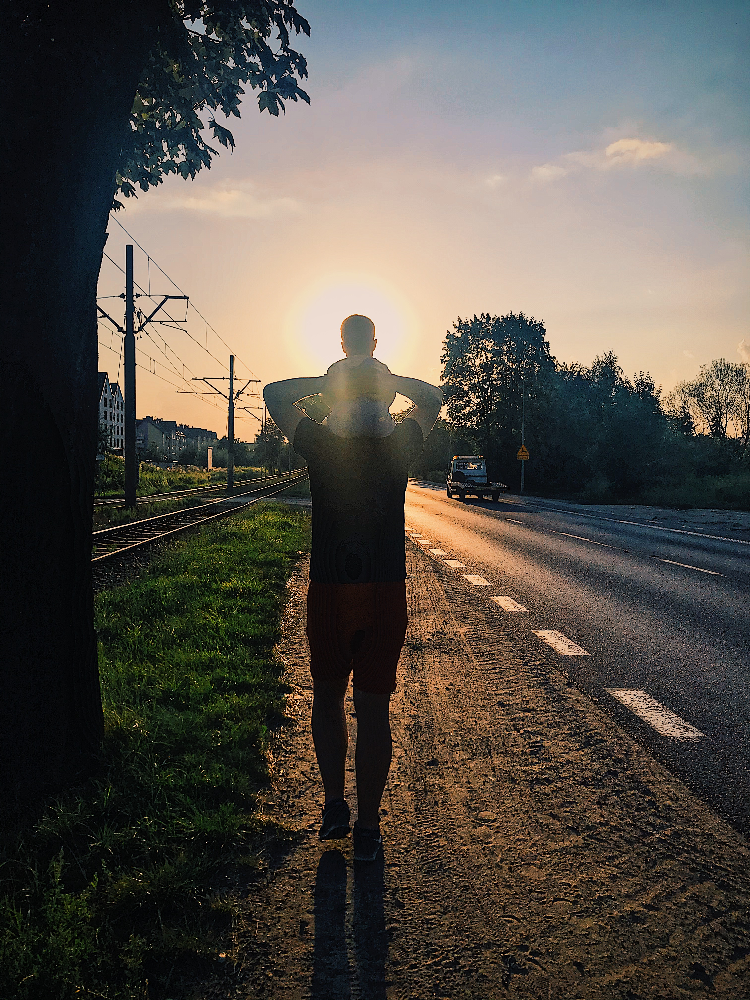
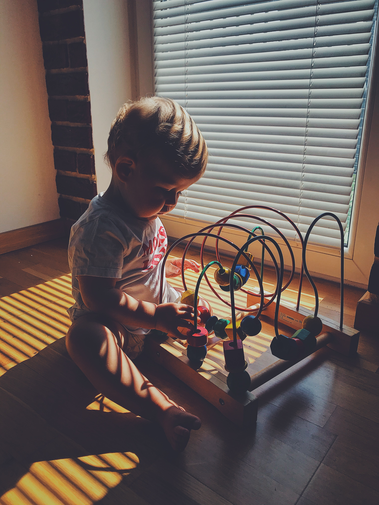
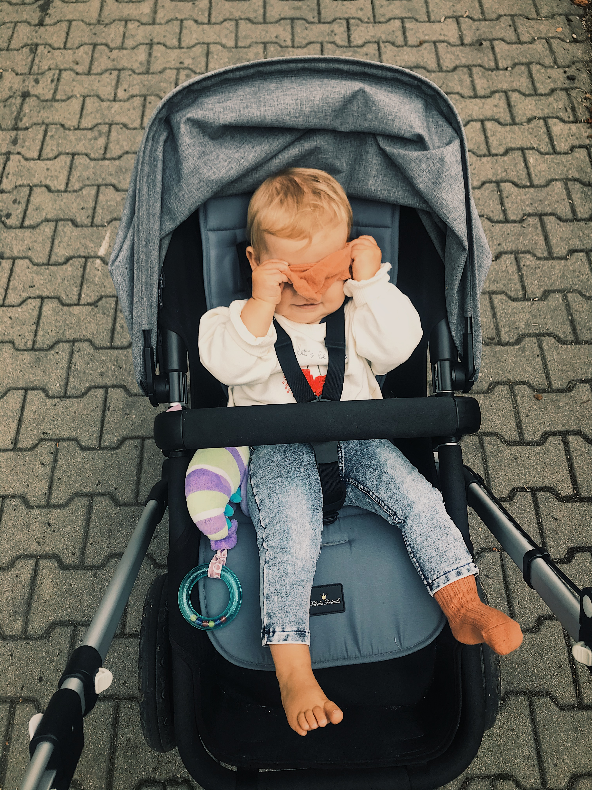
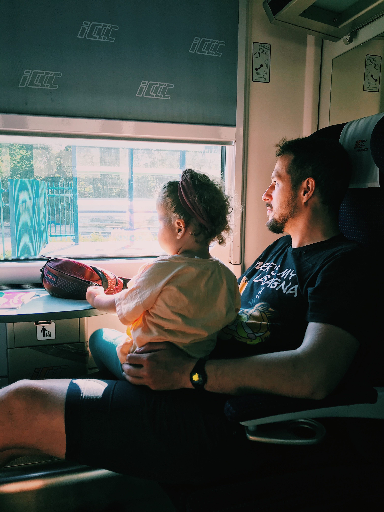
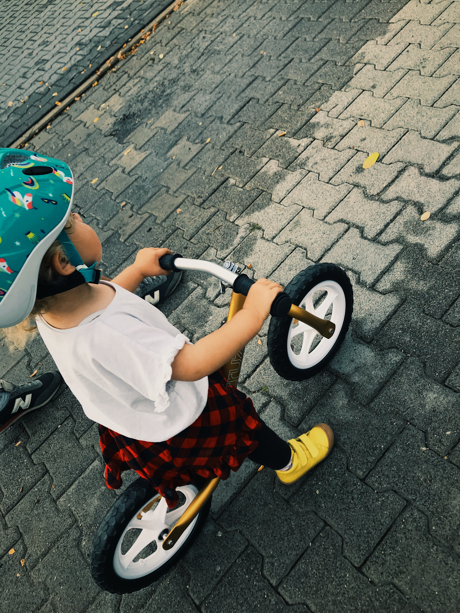
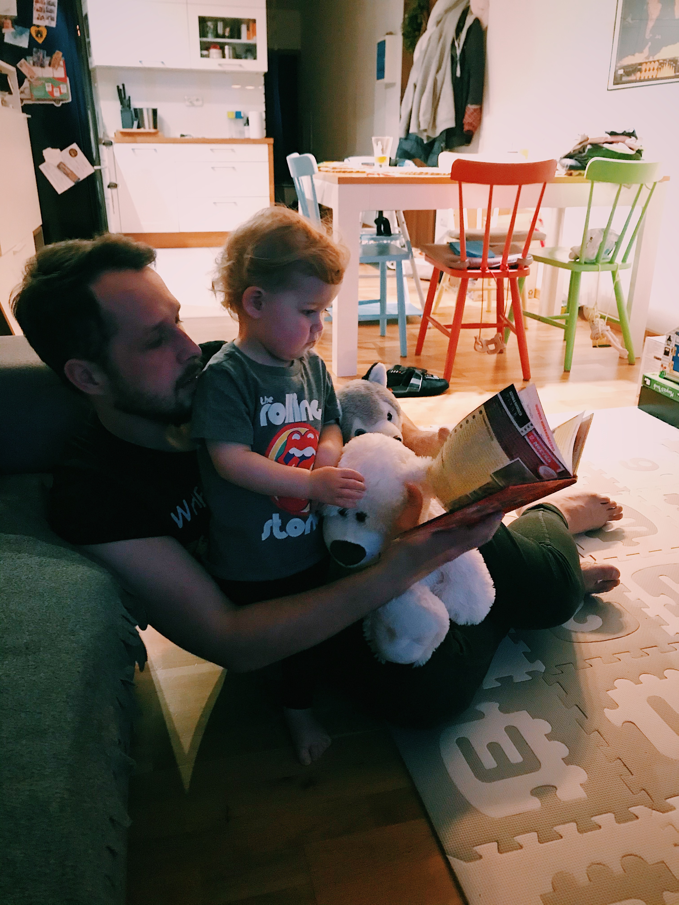
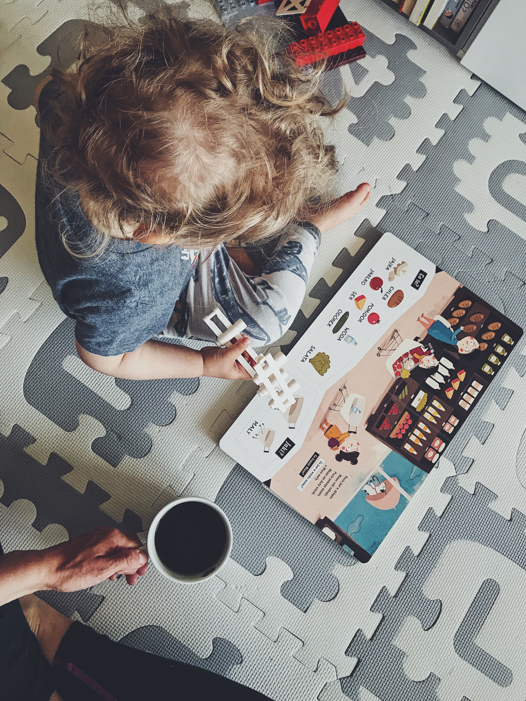
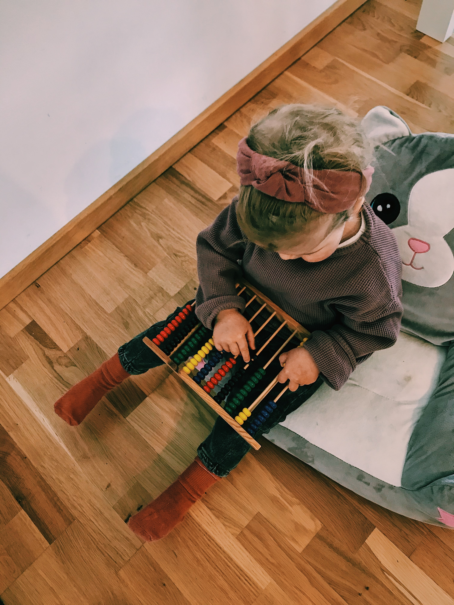

Stworzenie tego bloga wyszło z inicjatywy Starego przed podróżą do Stanów, która zarazem była naszym Honeymoon. Blog stworzony dla nas jako nasza- pamięć zewnętrzna, na długie długie lata, na to liczę. Rodzaj zapisków czy też pamiętnika do którego będziemy mogli wrócić kiedy pamięć zacznie zawodzić ale nie tylko. Pochwała dla Niego, bo wymagało to nie lada determinacji i chęci, a co więcej walki ze zmęczeniem po całodziennym przemaszerowaniu masy km czy też nie wiele mniejszej liczbie mil. Z tego też powodu wpisy bardzo często powstawały z rana przed rozpocząciem nowego dnia. Spisywał wrażenia, przygody, historie, widoki, krajobrazy, smaki, nastroje im towarzyszące. Blog ten, skromny bo skromny, kręci się głównie dookoła naszych podróży, przynajmniej tak było do niedawna, dlatego też postanowiłam napisać o najdłuższej z nich która trwa już ponad rok a nawer dwa takie "roki" zaraz będa, bo tak mi idzie pisanie.

Ponad rok wspólnej podróży z Naszą Małą Obywatelką. To podróż nie tylko najdłuższa jak do tej pory ale i najbardziej odległa i niosiąca ze sobą odkrywanie tego co w świecie najlepsze chyba. 

Kiedy to zleciało? Sami nie wiemy. Podróż nieporównywalna do żadnej. Podróż tą najbardziej trafnie można przyrównać do przejażdzki na rollercoaster. Emocje, gwałowne wzniesiania, zakręty, spadki, inwersja, uśmiech, łzy, radość. Wspomnienia piszą się same a fotografii i filmów robimy nie mniej niż podróżując po Stanach. Kiedy to zleciało? Ten pierwszy rok przypadł nam na dość nietypowy czas. Zamknięci w swoich domach, z ograniczeniami, z zachowaniem ostrożności. Początkowo z naszego wyboru bo była to izolacja wynikająca z wdrażania się w nową rolę i trochę klosz ochronny naszej Obywatelki, która dość płynnie przeszła w tę wynikającą z epidemii - COVID-19. Dziwne czasy. Piszę się nowa historia, nikt się tego nie spodziewał, że takie czasy nadejdą.

Początki.

Niełatwe, nabuzowane emocjami, jedna wielka niewiadoma, obawy wynikające z tego czy damy radę, czy poradzimy - chyba bardziej moje, bo Oskar zawsze powtarzał i tym samym
dawał mi wsparcie: _"Inni sobie radzą to dlaczego my mielibyśmy nie"_. Wielkie dzięki za to. 

Czy było ciężko? Trochę.

Kolki, to powie chyba już dużo. Zwłaszcza na początku jak jeszcze nie wiesz, że to to. Całe szczęście nasza położna bardzo szybko nam w tym pomogła. Dzidziuś płacze a Ty nie wiesz co się dzieje, nie wiesz jak pomóc, kąpiele, masaże, noszenie, śpiewanie, okłady, mokro, za ciepło, za zimno, głód, przytulanie, co robisz nie tak. Aż w końcu płaczesz razem z Dzidziusiem, co wcale a wcale nie uławia bo One to wyczuwają, wszystkie emocje i przechwytują od razu. Tata tu jest bardzo ważny. Bardzo często u nas ratuje całą sytuację.
Nosił Obywatelkę na "Supermenkę" masując jednocześnie brzuszek - pomagało. Mama musi wziąć głeboki oddech i się uspokoić po tym bardzo często uspokaja się też i Dzidziuś. Spacer żeby wyrzucić śmieci. O tak, w pierwszych tygodniach była to moja ulubiona czynność - podróż. A i tak zdarzało się, że Obywatelki radar nie zawodził. Dlaczego nie dłuższy, fizycznie moje ciało i jego kondycja nie były jeszcze na to gotowe, nawet przy takiej podrózy jak ta powyżej łapałam zadyszki. Poród to jak wyjście w wysokie góry dla niedoświadczonego piechura ale o tym nie będę tu pisać. Dlaczego? Bo już nie wiele pamiętam i o to tu właśnie chodzi. Czy inne mamy się ze mną zgodzą? Mija tydzień, dwa, pięć i młody rodzic wie już coraz więcej, nauczył się obsługi, mniej się stresuje, z większym spokojem podchodzi już do tych wszystkich czynności.

Kolejne miesiące.

Obywatelka jest przecudowna, lubi leżeć na brzuszku, lubi jak się jej macha nad głową papierowym żółtym świderkiem, albo kulą - rybą nazwaną Piotruś. Zaczynają się postępy w rozwoju, uśmiechy, guganie, śmiech, przewroty, pełzanie. Tak sprawnie pełzała, że byliśmy wręcz przekonani że raczkowanie ominie i zacznie od razu chodzić.
Jednak nie. Raczkuje a raczej raczkowała bo już za nami 1,5 roku. Trochę pisanie moje się wydłużyło jak widać. Co więcej już chodzi a nawet biega, śmiga na 3-kołowym rowerku i zaczyna się rozgadywać.

MAMA, TATA, BABA, LULU, CIOCIA, PEPA (TŁ. KALAREPA), PEPE (Wujek Przemek), CIOCIA EA (Ciocia Ewa), PAPA (piłka).

Pełno przeróżnych dźwięków umie z siebie wydobyć, naśladować odgłosy zwierząt i przedmiotów mniej lubi bardziej zbliżonych do tych rzeczywistych. Wie jak żyrafa wygina szyję, wie że zebra ma paski a słoń tupie nogami, umie uklęknąć na kolanie jak wielbłąd i drapać jak kot. Czytamy bardzo dużo, Obywatelka uwielbia książki. Czy ma ulubioną?! To często się zmienia. Był "Kotek" - Drabik Wiesław, ale pierwsza to chyba " Kreska Kreska kółeczko, rysuję tu słoneczko (...)". Umie już na prawdę bardzo dużo. Aż się Człowiek dziwi, czy to normalne czy może nasze dziecko to jakiś super dzieciak z super mocami. 

Fajna jesteś Urszulko !

Wiadomo, że te wesołe chwile niosą też zmęczenie i niewyspanie. Połamani i nie dospani - tacy wstajemy prawie codziennie. Obywatelka śpi razem z nami i zajmuje w łóżku najwięcej miejsca pomimo że jest najmniejsza. Momentami brak też cierpliwości, sił, monotonia zwłaszcza przez te czasy covidowe trochę daje popalić.

Ale ciągniemy to, ciągniemy ten nasz bardzo przyjemny trip. Podróż życia. Poznajemy świat oczami małej Obywatelki, cieszą nas rzeczy najmniejsze, zwracamy uwagę nawet na mrówki i muchy bo one tak potrafią fascynować człowieka dla którego wszystko dookoła jest nowe.

Czy rekomenduejmy taką podróż?

Jak najbardziej, jest to podróż dla każego inna, z innymi wrażeniami, każdy przeżyje ją inaczej i to w niej właśnie najciekawsze.

Więc tak polecamy. 

